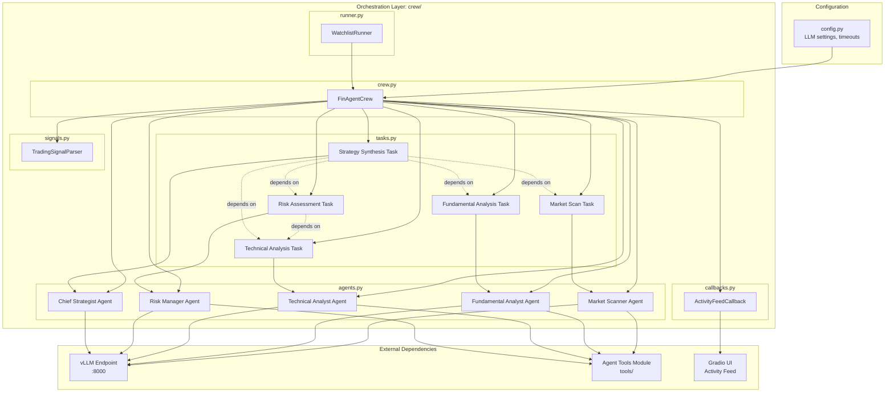
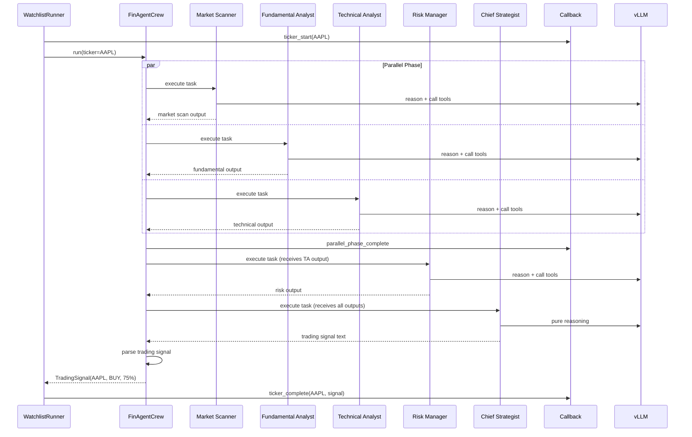
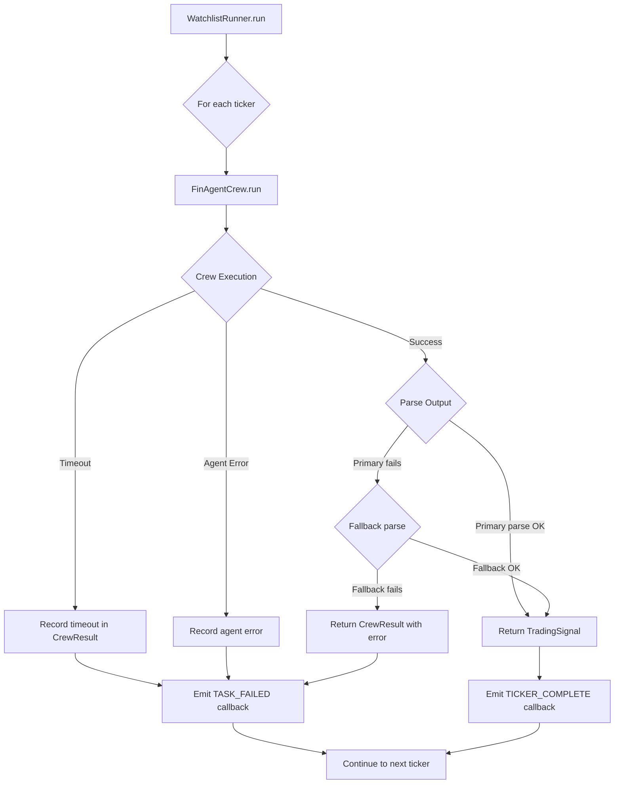

# Design Document: Agent Orchestration

## Overview

This design covers the CrewAI multi-agent orchestration layer that coordinates five specialized AI agents to analyze financial tickers and produce structured trading signals. The module is the central pipeline connecting the vLLM inference endpoint (from `inference-setup`) with the agent tool functions (from `agent-tools`) and the Gradio UI (from `gradio-frontend`).

Key design decisions:

- **CrewAI as orchestration framework**: Provides built-in agent/task/crew abstractions with support for parallel execution, task dependencies, and callback hooks — avoiding custom orchestration code
- **Hybrid execution process**: First three agents (Market Scanner, Fundamental Analyst, Technical Analyst) run in parallel for speed, then Risk Manager and Chief Strategist run sequentially for dependency correctness
- **Single LLM instance shared across agents**: All agents connect to the same vLLM endpoint via `ChatOpenAI(base_url=...)`, reducing memory overhead and simplifying configuration
- **String-based inter-agent communication**: Agent outputs are plain text strings passed as task context to downstream agents, matching the tool module's string-only return pattern
- **Fault-isolated multi-ticker loop**: Each ticker runs as an independent crew execution; failures in one ticker don't affect others
- **Callback-driven activity feed**: A single callback function receives structured event payloads at every lifecycle point, decoupling the orchestration layer from the UI

## Architecture



### Execution Flow



### Module Layout

```
crew/
├── __init__.py          # Re-exports FinAgentCrew, WatchlistRunner
├── config.py            # LLM configuration, timeouts, constants
├── agents.py            # Agent factory functions
├── tasks.py             # Task factory functions with dependencies
├── crew.py              # FinAgentCrew class (main orchestrator)
├── callbacks.py         # ActivityFeedCallback implementation
├── signals.py           # TradingSignal dataclass + parser
└── runner.py            # WatchlistRunner (multi-ticker loop)
```

## Components and Interfaces

### 1. Configuration Module (`config.py`)

Centralizes all configurable parameters for the orchestration layer.

```python
from dataclasses import dataclass, field


@dataclass
class LLMConfig:
    """Configuration for the vLLM endpoint connection."""
    base_url: str = "http://localhost:8000/v1"
    model_name: str = "Qwen/Qwen3-8B"
    temperature: float = 0.7
    max_tokens: int = 1024
    request_timeout: int = 120  # seconds


@dataclass
class CrewConfig:
    """Configuration for crew execution parameters."""
    max_iterations: int = 5
    task_timeout: int = 120  # seconds per task
    verbose: bool = True


@dataclass
class OrchestratorConfig:
    """Top-level configuration combining all settings."""
    llm: LLMConfig = field(default_factory=LLMConfig)
    crew: CrewConfig = field(default_factory=CrewConfig)
```

### 2. Agents Module (`agents.py`)

Factory functions that create configured CrewAI Agent instances.

```python
from crewai import Agent
from langchain_openai import ChatOpenAI


def create_llm(config: LLMConfig) -> ChatOpenAI:
    """Create a shared LLM instance pointing to the vLLM endpoint."""
    return ChatOpenAI(
        base_url=config.base_url,
        model=config.model_name,
        temperature=config.temperature,
        max_tokens=config.max_tokens,
        timeout=config.request_timeout,
        api_key="not-needed",  # vLLM doesn't require auth
    )


def create_market_scanner(llm: ChatOpenAI, tools: list) -> Agent:
    """Create the Market Scanner agent.

    Args:
        llm: Shared LLM instance
        tools: [search_news, get_price_change, get_volume]
    """
    return Agent(
        role="Market Scanner",
        goal="Detect significant market events, price movements, and volume anomalies for the given ticker",
        backstory=(
            "You are an experienced market surveillance specialist who monitors "
            "news feeds, price action, and trading volumes 24/7. You have a keen "
            "eye for detecting material events that could impact stock prices."
        ),
        llm=llm,
        tools=tools,
        max_iter=5,
        verbose=True,
    )


def create_fundamental_analyst(llm: ChatOpenAI, tools: list) -> Agent:
    """Create the Fundamental Analyst agent.

    Args:
        llm: Shared LLM instance
        tools: [get_financials, get_earnings, get_peers]
    """
    return Agent(
        role="Fundamental Analyst",
        goal="Determine the intrinsic value of the company by analyzing financial metrics, earnings trends, and peer comparisons",
        backstory=(
            "You are a seasoned equity research analyst with 15 years of experience "
            "in fundamental valuation. You specialize in dissecting financial statements, "
            "identifying earnings quality, and comparing companies against their peers."
        ),
        llm=llm,
        tools=tools,
        max_iter=5,
        verbose=True,
    )


def create_technical_analyst(llm: ChatOpenAI, tools: list) -> Agent:
    """Create the Technical Analyst agent.

    Args:
        llm: Shared LLM instance
        tools: [get_price_history, calculate_indicators]
    """
    return Agent(
        role="Technical Analyst",
        goal="Identify optimal entry and exit points using price patterns and technical indicators",
        backstory=(
            "You are a quantitative technical analyst who combines classical chart "
            "patterns with modern indicator analysis. You focus on RSI, MACD, "
            "Bollinger Bands, and moving average crossovers to time entries precisely."
        ),
        llm=llm,
        tools=tools,
        max_iter=5,
        verbose=True,
    )


def create_risk_manager(llm: ChatOpenAI, tools: list) -> Agent:
    """Create the Risk Manager agent.

    Args:
        llm: Shared LLM instance
        tools: [calculate_position_size, set_stop_loss]
    """
    return Agent(
        role="Risk Manager",
        goal="Protect capital through optimal position sizing and stop-loss placement based on volatility",
        backstory=(
            "You are a portfolio risk specialist who never lets a single trade "
            "risk more than the defined threshold. You use ATR-based stop-losses "
            "and position sizing formulas to ensure consistent risk management."
        ),
        llm=llm,
        tools=tools,
        max_iter=5,
        verbose=True,
    )


def create_chief_strategist(llm: ChatOpenAI) -> Agent:
    """Create the Chief Strategist agent (no tools, pure reasoning)."""
    return Agent(
        role="Chief Strategist",
        goal="Synthesize all agent analyses into a single, actionable trading signal with confidence level",
        backstory=(
            "You are the head of trading strategy with decades of experience "
            "integrating fundamental, technical, and risk perspectives into "
            "decisive trading calls. You weigh conflicting signals and produce "
            "clear BUY/SELL/HOLD recommendations with calibrated confidence."
        ),
        llm=llm,
        tools=[],
        max_iter=5,
        verbose=True,
    )
```

### 3. Tasks Module (`tasks.py`)

Factory functions that create CrewAI Task instances with proper dependencies.

```python
from crewai import Task, Agent


def create_market_scan_task(agent: Agent, ticker: str) -> Task:
    """Create the market scanning task."""
    return Task(
        description=(
            f"Analyze the current market conditions for {ticker}. "
            f"Search for recent news, check price changes, and identify volume anomalies. "
            f"Summarize any significant market events that could affect the stock."
        ),
        expected_output=(
            f"A summary of market conditions for {ticker} including: "
            f"key news events, price change magnitude and direction, "
            f"and whether volume is normal or unusual."
        ),
        agent=agent,
    )


def create_fundamental_task(agent: Agent, ticker: str) -> Task:
    """Create the fundamental analysis task."""
    return Task(
        description=(
            f"Perform a fundamental analysis of {ticker}. "
            f"Retrieve financial metrics, recent earnings data, and peer comparisons. "
            f"Assess whether the stock is overvalued, undervalued, or fairly valued."
        ),
        expected_output=(
            f"A valuation assessment for {ticker} including: "
            f"key financial metrics (P/E, margins, growth), "
            f"earnings trend and surprises, peer comparison, "
            f"and an overall fundamental outlook (bullish/bearish/neutral)."
        ),
        agent=agent,
    )


def create_technical_task(agent: Agent, ticker: str) -> Task:
    """Create the technical analysis task."""
    return Task(
        description=(
            f"Perform a technical analysis of {ticker}. "
            f"Retrieve price history and calculate technical indicators. "
            f"Identify the current trend, support/resistance levels, "
            f"and recommend entry and target prices."
        ),
        expected_output=(
            f"A technical analysis for {ticker} including: "
            f"current trend direction, RSI/MACD/Bollinger signals, "
            f"recommended entry price, and target price."
        ),
        agent=agent,
    )


def create_risk_task(agent: Agent, ticker: str, context: list[Task]) -> Task:
    """Create the risk assessment task.

    Args:
        agent: Risk Manager agent
        ticker: Stock symbol
        context: [technical_task] — depends on Technical Analyst output
    """
    return Task(
        description=(
            f"Calculate position sizing and stop-loss levels for {ticker}. "
            f"Use the entry price from the Technical Analyst's recommendation "
            f"to determine optimal position size and ATR-based stop-loss."
        ),
        expected_output=(
            f"Risk parameters for {ticker} including: "
            f"recommended position size, stop-loss price, "
            f"take-profit target, and risk-reward ratio."
        ),
        agent=agent,
        context=context,
    )


def create_strategy_task(agent: Agent, ticker: str, context: list[Task]) -> Task:
    """Create the strategy synthesis task.

    Args:
        agent: Chief Strategist agent
        ticker: Stock symbol
        context: [market_task, fundamental_task, technical_task, risk_task]
    """
    return Task(
        description=(
            f"Synthesize all analysis for {ticker} into a final trading signal. "
            f"Consider the market conditions, fundamental valuation, technical signals, "
            f"and risk parameters. Produce a clear BUY, SELL, or HOLD recommendation "
            f"with a confidence percentage.\n\n"
            f"Your output MUST follow this exact format:\n"
            f"{ticker} — ACTION (Confidence: XX%)\n"
            f"Entry: $XX.XX\n"
            f"Stop Loss: $XX.XX\n"
            f"Target: $XX.XX\n"
            f"Reasoning:\n"
            f"- Market: [summary]\n"
            f"- Fundamental: [summary]\n"
            f"- Technical: [summary]\n"
            f"- Risk: [summary]"
        ),
        expected_output=(
            f"A trading signal in the format: "
            f"'{ticker} — BUY/SELL/HOLD (Confidence: XX%)' "
            f"followed by entry, stop-loss, target prices and reasoning summaries."
        ),
        agent=agent,
        context=context,
    )
```

### 4. Crew Module (`crew.py`)

The main orchestrator class that assembles agents, tasks, and executes the pipeline.

```python
from crewai import Crew, Process
from dataclasses import dataclass
from typing import Optional, Callable


@dataclass
class CrewResult:
    """Result of a single ticker crew execution."""
    ticker: str
    signal: Optional["TradingSignal"]
    raw_output: str
    success: bool
    error: Optional[str] = None


class FinAgentCrew:
    """Orchestrates the multi-agent analysis pipeline for a single ticker."""

    def __init__(
        self,
        config: "OrchestratorConfig",
        tools: dict[str, list],
        callback: Optional[Callable] = None,
    ):
        """
        Args:
            config: Full orchestrator configuration
            tools: Dict mapping agent names to their tool lists:
                {
                    "market_scanner": [search_news, get_price_change, get_volume],
                    "fundamental_analyst": [get_financials, get_earnings, get_peers],
                    "technical_analyst": [get_price_history, calculate_indicators],
                    "risk_manager": [calculate_position_size, set_stop_loss],
                }
            callback: Optional activity feed callback function
        """

    def run(self, ticker: str) -> CrewResult:
        """Execute the full analysis pipeline for a single ticker.

        Returns:
            CrewResult with parsed TradingSignal on success,
            or error details on failure.
        """

    def _build_crew(self, ticker: str) -> Crew:
        """Assemble the Crew with agents, tasks, and process configuration."""
        # Creates agents via factory functions
        # Creates tasks with proper dependencies
        # Returns Crew(
        #     agents=[...],
        #     tasks=[...],
        #     process=Process.sequential,  # CrewAI manages parallel via task deps
        #     verbose=config.crew.verbose,
        # )

    def _parse_output(self, raw_output: str, ticker: str) -> Optional["TradingSignal"]:
        """Parse crew output into a TradingSignal, using fallback parser if needed."""
```

### 5. Callbacks Module (`callbacks.py`)

Implements the activity feed callback interface for real-time UI updates.

```python
from dataclasses import dataclass
from datetime import datetime
from typing import Callable, Optional
from enum import Enum


class EventType(str, Enum):
    """Types of activity feed events."""
    TICKER_START = "ticker_start"
    TICKER_COMPLETE = "ticker_complete"
    TASK_START = "task_start"
    TASK_COMPLETE = "task_complete"
    TASK_FAILED = "task_failed"
    AGENT_OUTPUT = "agent_output"
    CREW_ERROR = "crew_error"


@dataclass
class ActivityEvent:
    """Structured payload for activity feed callbacks."""
    event_type: EventType
    agent_name: str
    ticker: str
    message: str
    timestamp: datetime


class ActivityFeedCallback:
    """Manages activity feed event dispatch to the Gradio UI."""

    def __init__(self, handler: Callable[[ActivityEvent], None]):
        """
        Args:
            handler: Function that receives ActivityEvent payloads.
                     Typically connected to a Gradio state update.
        """

    def on_ticker_start(self, ticker: str) -> None:
        """Emit event when a ticker analysis begins."""

    def on_ticker_complete(self, ticker: str, signal: Optional["TradingSignal"]) -> None:
        """Emit event when a ticker analysis completes."""

    def on_task_start(self, agent_name: str, ticker: str) -> None:
        """Emit event when an agent task begins execution."""

    def on_task_complete(self, agent_name: str, ticker: str, output_summary: str) -> None:
        """Emit event when an agent task completes successfully."""

    def on_task_failed(self, agent_name: str, ticker: str, error: str) -> None:
        """Emit event when an agent task fails."""

    def on_agent_output(self, agent_name: str, ticker: str, output: str) -> None:
        """Emit event for intermediate agent output."""

    def _emit(self, event: ActivityEvent) -> None:
        """Dispatch event to the registered handler."""
```

### 6. Signals Module (`signals.py`)

Defines the trading signal data model and parsing logic.

```python
from dataclasses import dataclass
from enum import Enum
from typing import Optional
import re


class Action(str, Enum):
    """Trading signal actions."""
    BUY = "BUY"
    SELL = "SELL"
    HOLD = "HOLD"


@dataclass
class TradingSignal:
    """Structured trading signal output."""
    ticker: str
    action: Action
    confidence: int  # 0-100
    entry_price: Optional[float] = None
    stop_loss: Optional[float] = None
    target_price: Optional[float] = None
    reasoning: Optional[dict[str, str]] = None  # {agent_name: summary}


class TradingSignalParser:
    """Parses raw LLM output into structured TradingSignal objects."""

    # Primary format: "AAPL — BUY (Confidence: 75%)"
    PRIMARY_PATTERN = re.compile(
        r"([A-Z\-\.]+)\s*[—–-]\s*(BUY|SELL|HOLD)\s*\(Confidence:\s*(\d{1,3})%\)",
        re.IGNORECASE,
    )

    # Fallback patterns for less structured output
    ACTION_PATTERN = re.compile(r"\b(BUY|SELL|HOLD)\b", re.IGNORECASE)
    CONFIDENCE_PATTERN = re.compile(r"(\d{1,3})\s*%")
    PRICE_PATTERN = re.compile(r"\$\s*([\d,]+\.?\d*)")

    def parse(self, raw_output: str, ticker: str) -> Optional[TradingSignal]:
        """Parse raw output into a TradingSignal.

        Attempts primary pattern first, falls back to heuristic extraction.

        Args:
            raw_output: Raw text from Chief Strategist agent
            ticker: Expected ticker symbol

        Returns:
            TradingSignal if parsing succeeds, None if output is unparseable
        """

    def _parse_primary(self, raw_output: str, ticker: str) -> Optional[TradingSignal]:
        """Attempt to parse using the primary structured format."""

    def _parse_fallback(self, raw_output: str, ticker: str) -> Optional[TradingSignal]:
        """Attempt heuristic extraction from unstructured output."""

    def _extract_prices(self, raw_output: str) -> dict[str, Optional[float]]:
        """Extract entry, stop-loss, and target prices from text."""

    def _extract_reasoning(self, raw_output: str) -> Optional[dict[str, str]]:
        """Extract per-agent reasoning summaries from text."""

    @staticmethod
    def validate_confidence(value: int) -> int:
        """Clamp confidence to 0-100 range."""
        return max(0, min(100, value))
```

### 7. Runner Module (`runner.py`)

Handles multi-ticker watchlist execution with fault isolation.

```python
from dataclasses import dataclass
from typing import Optional, Callable


@dataclass
class WatchlistResult:
    """Aggregated results from a full watchlist run."""
    signals: list["CrewResult"]
    total_tickers: int
    successful: int
    failed: int


class WatchlistRunner:
    """Executes the analysis pipeline across multiple tickers sequentially."""

    def __init__(
        self,
        config: "OrchestratorConfig",
        tools: dict[str, list],
        callback: Optional[Callable] = None,
    ):
        """
        Args:
            config: Orchestrator configuration
            tools: Tool mapping for agents
            callback: Activity feed callback handler
        """

    def run(self, watchlist: str) -> WatchlistResult:
        """Run analysis for all tickers in the watchlist.

        Args:
            watchlist: Comma-separated ticker symbols (e.g., "AAPL,MSFT,GOOGL")

        Returns:
            WatchlistResult with all signals and summary statistics
        """

    def _parse_watchlist(self, watchlist: str) -> list[str]:
        """Parse and validate comma-separated ticker string.

        Returns list of normalized (uppercase, trimmed) ticker symbols.
        Skips empty entries from extra commas.
        """

    def _run_single(self, ticker: str) -> "CrewResult":
        """Execute crew for a single ticker with error isolation."""
```

## Data Models

### TradingSignal

```python
@dataclass
class TradingSignal:
    ticker: str                          # e.g., "AAPL"
    action: Action                       # BUY | SELL | HOLD
    confidence: int                      # 0-100 inclusive
    entry_price: Optional[float]         # e.g., 185.42
    stop_loss: Optional[float]           # e.g., 180.55
    target_price: Optional[float]        # e.g., 192.17
    reasoning: Optional[dict[str, str]]  # {"Market Scanner": "...", ...}
```

### ActivityEvent

```python
@dataclass
class ActivityEvent:
    event_type: EventType    # Enum: ticker_start, task_start, etc.
    agent_name: str          # e.g., "Market Scanner" or "system"
    ticker: str              # e.g., "AAPL"
    message: str             # Human-readable description
    timestamp: datetime      # UTC timestamp
```

### CrewResult

```python
@dataclass
class CrewResult:
    ticker: str                          # Analyzed ticker
    signal: Optional[TradingSignal]      # Parsed signal (None on failure)
    raw_output: str                      # Raw text from crew execution
    success: bool                        # Whether parsing succeeded
    error: Optional[str]                 # Error message if failed
```

### WatchlistResult

```python
@dataclass
class WatchlistResult:
    signals: list[CrewResult]   # One per ticker in watchlist
    total_tickers: int          # Total tickers attempted
    successful: int             # Count of successful analyses
    failed: int                 # Count of failed analyses
```

### Configuration Hierarchy

```
OrchestratorConfig
├── LLMConfig
│   ├── base_url: str = "http://localhost:8000/v1"
│   ├── model_name: str = "Qwen/Qwen3-8B"
│   ├── temperature: float = 0.7
│   ├── max_tokens: int = 1024
│   └── request_timeout: int = 120
└── CrewConfig
    ├── max_iterations: int = 5
    ├── task_timeout: int = 120
    └── verbose: bool = True
```

### Trading Signal Output Format

The expected text format from the Chief Strategist:

```
AAPL — BUY (Confidence: 75%)
Entry: $185.42
Stop Loss: $180.55
Target: $192.17
Reasoning:
- Market: Positive earnings surprise and unusual volume detected
- Fundamental: Undervalued relative to peers with strong growth
- Technical: RSI neutral, MACD bullish crossover, price near support
- Risk: 1:2 risk-reward ratio with ATR-based stop at $180.55
```

## Correctness Properties

_A property is a characteristic or behavior that should hold true across all valid executions of a system — essentially, a formal statement about what the system should do. Properties serve as the bridge between human-readable specifications and machine-verifiable correctness guarantees._

### Property 1: LLM base_url propagation

_For any_ valid URL string provided as `base_url` in the LLMConfig, when the crew is constructed, every agent's LLM instance SHALL have its `base_url` set to that exact string.

**Validates: Requirements 1.2**

### Property 2: Trading signal round-trip parsing

_For any_ valid TradingSignal instance (with a valid ticker, action in {BUY, SELL, HOLD}, confidence in 0-100, and non-negative prices), formatting it into the expected output string and then parsing that string back SHALL produce a TradingSignal with the same ticker, action, confidence, entry_price, stop_loss, and target_price values.

**Validates: Requirements 6.2, 6.3, 9.1**

### Property 3: Action field validation

_For any_ string that does not contain exactly one of "BUY", "SELL", or "HOLD" as a standalone word, the parser SHALL either return None or extract only a valid Action enum value — never an invalid action string.

**Validates: Requirements 9.2**

### Property 4: Confidence clamping to valid range

_For any_ integer value (including values outside 0-100), the `validate_confidence` function SHALL return a value clamped to the range [0, 100] inclusive, such that values below 0 become 0 and values above 100 become 100.

**Validates: Requirements 9.3**

### Property 5: Fallback parser extraction

_For any_ string containing one of "BUY", "SELL", or "HOLD" as a word and a number followed by "%" (even in non-standard formatting), the fallback parser SHALL extract the action and confidence percentage, returning a TradingSignal with the correct action and a confidence value in [0, 100].

**Validates: Requirements 9.4**

### Property 6: Unparseable output yields None

_For any_ string that contains none of the words "BUY", "SELL", or "HOLD", the parser SHALL return None, indicating the output is unparseable.

**Validates: Requirements 8.3**

### Property 7: Watchlist parsing produces normalized ticker list

_For any_ comma-separated string of ticker symbols (with arbitrary whitespace and mixed case), `_parse_watchlist` SHALL return a list of uppercase, trimmed ticker strings with empty entries removed, and the count of returned tickers SHALL equal the number of non-empty segments in the input.

**Validates: Requirements 10.1**

### Property 8: WatchlistResult aggregation invariant

_For any_ list of CrewResult objects, the WatchlistResult SHALL have `total_tickers` equal to the length of the list, `successful` equal to the count where `success=True`, and `failed` equal to the count where `success=False`, such that `successful + failed == total_tickers`.

**Validates: Requirements 10.2**

### Property 9: ActivityEvent structural completeness

_For any_ combination of valid EventType, non-empty agent_name string, non-empty ticker string, message string, and datetime timestamp, constructing an ActivityEvent SHALL produce an object where all five fields are accessible and match the input values exactly.

**Validates: Requirements 11.1, 11.4**

## Error Handling

### Error Handling Strategy

The orchestration layer uses a **graceful degradation with logging** approach. Failures at any level are caught, recorded in the activity feed, and the system continues processing where possible. This ensures a single agent timeout or parsing failure doesn't crash the entire multi-ticker pipeline.

### Error Boundaries



### Error Categories

| Error Category      | Source               | Detection                   | Response                            | Continues?              |
| ------------------- | -------------------- | --------------------------- | ----------------------------------- | ----------------------- |
| LLM unreachable     | Agent initialization | Connection timeout (10s)    | Raise descriptive error, abort crew | No                      |
| Task timeout        | Agent execution      | 120s wall-clock exceeded    | Terminate task, record failure      | Yes (independent tasks) |
| Max iterations      | Agent reasoning      | 5 loops exceeded            | CrewAI forces output                | Yes                     |
| Unparseable output  | Chief Strategist     | Parser returns None         | Record raw output + error           | Yes (next ticker)       |
| Tool failure        | Agent tool call      | Tool returns "Error: ..."   | Agent sees error string, adapts     | Yes                     |
| Predecessor failure | Task dependency      | Task marked failed          | Skip dependent tasks                | Yes (next ticker)       |
| Invalid ticker      | Watchlist parsing    | Empty/whitespace after trim | Skip ticker, log warning            | Yes (next ticker)       |

### Failure Propagation Rules

1. **Parallel tasks are independent**: If Market Scanner fails, Fundamental and Technical Analysts continue unaffected.
2. **Sequential dependencies cascade**: If Technical Analyst fails, Risk Manager is skipped (no entry price available).
3. **Chief Strategist requires all inputs**: If any predecessor fails, the strategy task runs with partial context and notes the missing analysis.
4. **Ticker failures are isolated**: A failure for AAPL does not affect MSFT analysis.

### Timeout Handling

```python
# CrewAI task-level timeout configuration
Task(
    ...,
    timeout=config.crew.task_timeout,  # 120 seconds
)

# Agent-level iteration limit
Agent(
    ...,
    max_iter=config.crew.max_iterations,  # 5 iterations
)
```

When a timeout occurs:

1. CrewAI terminates the agent's current reasoning loop
2. The task is marked as failed with a timeout error
3. The callback emits a `TASK_FAILED` event with the timeout details
4. Dependent tasks check predecessor status before executing

### Activity Feed Error Events

Every failure generates a structured callback event:

```python
ActivityEvent(
    event_type=EventType.TASK_FAILED,
    agent_name="Technical Analyst",
    ticker="AAPL",
    message="Task timed out after 120 seconds",
    timestamp=datetime.utcnow(),
)
```

## Testing Strategy

### Testing Approach

This feature uses a **dual testing approach**:

- **Property-based tests** for pure logic components (signal parsing, watchlist parsing, confidence validation, config propagation, aggregation invariants)
- **Unit tests** (example-based) for specific scenarios, dependency wiring, callback invocation, and error handling paths
- **Integration tests** for end-to-end crew execution against the vLLM endpoint

### Property-Based Tests

**Library:** [Hypothesis](https://hypothesis.readthedocs.io/) (Python)

**Configuration:** Minimum 100 iterations per property test (`@settings(max_examples=100)`)

| Property   | Test Description                                                                                                                     | Tag                                                                                         |
| ---------- | ------------------------------------------------------------------------------------------------------------------------------------ | ------------------------------------------------------------------------------------------- |
| Property 1 | Generate random valid URL strings, create crew, verify all agents have matching base_url                                             | Feature: agent-orchestration, Property 1: LLM base_url propagation                          |
| Property 2 | Generate random TradingSignal instances (valid ticker, action, confidence, prices), format to string, parse back, verify equivalence | Feature: agent-orchestration, Property 2: Trading signal round-trip parsing                 |
| Property 3 | Generate random strings without BUY/SELL/HOLD, verify parser returns None or valid Action only                                       | Feature: agent-orchestration, Property 3: Action field validation                           |
| Property 4 | Generate random integers (including negatives and >100), verify validate_confidence returns value in [0, 100]                        | Feature: agent-orchestration, Property 4: Confidence clamping to valid range                |
| Property 5 | Generate strings containing one action word + a percentage in varied formats, verify fallback parser extracts correctly              | Feature: agent-orchestration, Property 5: Fallback parser extraction                        |
| Property 6 | Generate random strings without any action words, verify parser returns None                                                         | Feature: agent-orchestration, Property 6: Unparseable output yields None                    |
| Property 7 | Generate comma-separated strings with mixed case, extra spaces, empty segments, verify normalized output list                        | Feature: agent-orchestration, Property 7: Watchlist parsing produces normalized ticker list |
| Property 8 | Generate random lists of CrewResult with varying success/failure, verify aggregation counts                                          | Feature: agent-orchestration, Property 8: WatchlistResult aggregation invariant             |
| Property 9 | Generate random valid field values, construct ActivityEvent, verify all fields match inputs                                          | Feature: agent-orchestration, Property 9: ActivityEvent structural completeness             |

### Unit Tests (Example-Based)

| Test                                 | Validates               | Description                                                                               |
| ------------------------------------ | ----------------------- | ----------------------------------------------------------------------------------------- |
| Agent role configuration             | 2.1, 3.1, 4.1, 5.1, 6.1 | Verify each agent factory produces agent with correct role string                         |
| Agent tool assignment                | 2.1, 3.1, 4.1, 5.1, 6.1 | Verify each agent has exactly the specified tools (Chief Strategist has none)             |
| Agent max_iter setting               | 2.4, 3.4, 4.4, 5.4, 6.6 | Verify all agents have max_iter=5                                                         |
| Task dependency wiring               | 7.1, 7.2, 7.3           | Verify parallel tasks have no context, risk depends on technical, strategy depends on all |
| Predecessor failure skips dependents | 7.4                     | Mock technical task failure, verify risk and strategy tasks are skipped                   |
| Timeout failure recording            | 8.1                     | Mock timeout, verify CrewResult contains timeout error                                    |
| Callback on task start/complete      | 11.1                    | Mock crew execution, verify callbacks fire with correct agent names                       |
| Callback on ticker start/complete    | 11.3                    | Run watchlist, verify ticker lifecycle callbacks                                          |
| Callback on intermediate output      | 11.2                    | Simulate agent output, verify callback receives summary                                   |
| Failure callback emission            | 8.4                     | Simulate failure, verify TASK_FAILED event emitted                                        |
| Ticker failure isolation             | 10.3                    | Mock failure for one ticker, verify others complete                                       |
| Ticker start/complete logging        | 10.4                    | Run multi-ticker, verify activity feed logs for each                                      |
| LLM connection error                 | 1.3                     | Mock unreachable endpoint, verify descriptive error within 10s                            |
| Parser with well-formatted input     | 9.1                     | Provide exact format string, verify all fields parsed                                     |
| Parser reasoning extraction          | 6.4                     | Provide output with reasoning sections, verify dict extraction                            |

### Integration Tests

| Test                          | Validates               | Description                                                                           |
| ----------------------------- | ----------------------- | ------------------------------------------------------------------------------------- |
| Full single-ticker pipeline   | 2.2, 3.2, 4.2, 5.2, 6.2 | Run crew for one ticker against live vLLM, verify TradingSignal produced              |
| Multi-ticker watchlist        | 10.1, 10.2              | Run 3-ticker watchlist, verify all signals aggregated                                 |
| Parallel execution timing     | 7.1                     | Verify first 3 tasks complete in roughly the same wall-clock time (not 3x sequential) |
| End-to-end with activity feed | 11.1, 11.2, 11.3        | Run full pipeline, verify all expected callback events received in order              |

### Test Execution Order

1. **Property tests** — fast, no external dependencies, pure logic (CI)
2. **Unit tests** — fast, mocked dependencies (CI)
3. **Integration tests** — require running vLLM endpoint (manual/scheduled)
