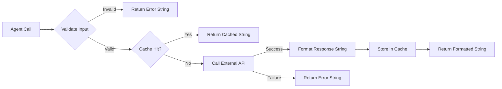
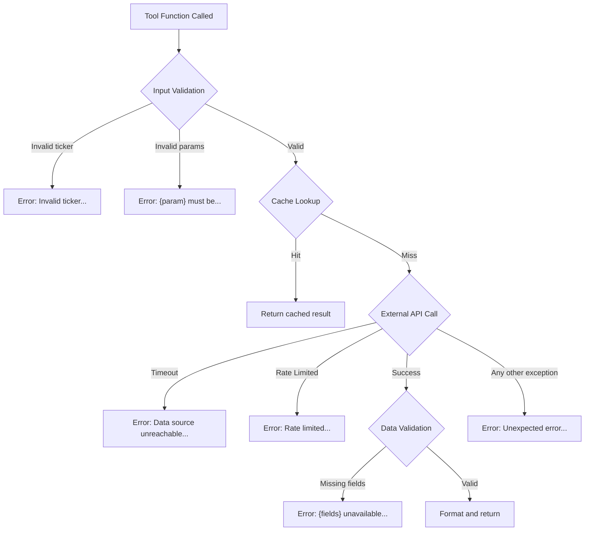

# Design Document: Agent Tools

## Overview

This design covers the Python tool functions that CrewAI agents invoke to perform financial research and generate trading signals. The module is organized into four domain-specific submodules — market scanning, fundamental analysis, technical analysis, and risk management — unified by a shared caching layer and consistent error handling patterns.

Key design decisions:

- **Domain-based module organization**: Tools are grouped by agent responsibility (market scanner, fundamental analyst, technical analyst, risk manager) to keep each file focused and independently testable
- **Decorator-based tool registration**: Each function uses CrewAI's `@tool` decorator with a descriptive docstring, making tools auto-discoverable by agents
- **String-only returns**: All tools return formatted strings (never dicts or objects) because CrewAI agents consume text — this simplifies the agent-tool interface
- **Centralized TTL cache**: A single in-memory cache module handles all API response caching with 5-minute TTL and 15-minute eviction, avoiding redundant external calls
- **Defensive error handling**: Every tool wraps its body in a try/except that catches all exceptions and returns an error string, ensuring agent workflows never crash from tool failures

The module depends on three keyless external libraries:

- [yfinance](https://ranaroussi.github.io/yfinance/) — stock/crypto price data, financials, earnings
- [duckduckgo-search](https://pypi.org/project/duckduckgo-search/) — news article retrieval
- [pandas-ta](https://pypi.org/project/pandas-ta-remake/) — technical indicator calculations (RSI, MACD, Bollinger Bands, SMA, ATR)

## Architecture

```mermaid
graph TD
    subgraph "CrewAI Agent Layer"
        A1[Market Scanner Agent]
        A2[Fundamental Analyst Agent]
        A3[Technical Analyst Agent]
        A4[Risk Manager Agent]
    end

    subgraph "Tool Module: tools/"
        subgraph "market_scanner.py"
            T1[search_news]
            T2[get_price_change]
            T3[get_volume]
        end

        subgraph "fundamental_analyst.py"
            T4[get_financials]
            T5[get_earnings]
            T6[get_peers]
        end

        subgraph "technical_analyst.py"
            T7[get_price_history]
            T8[calculate_indicators]
        end

        subgraph "risk_manager.py"
            T9[calculate_position_size]
            T10[set_stop_loss]
        end

        subgraph "cache.py"
            C[TTLCache]
        end

        subgraph "utils.py"
            U1[validate_ticker]
            U2[format_currency]
            U3[safe_get]
        end
    end

    subgraph "External Data Sources"
        E1[Yahoo Finance API]
        E2[DuckDuckGo Search]
    end

    A1 --> T1 & T2 & T3
    A2 --> T4 & T5 & T6
    A3 --> T7 & T8
    A4 --> T9 & T10

    T1 --> C
    T2 --> C
    T3 --> C
    T4 --> C
    T5 --> C
    T6 --> C
    T7 --> C
    T8 --> C
    T10 --> C

    T1 --> E2
    T2 & T3 & T4 & T5 & T6 & T7 & T8 & T10 --> E1

    T1 & T2 & T3 & T4 & T5 & T6 & T7 & T8 & T9 & T10 --> U1
    T4 & T9 --> U2
```



### Data Flow Pattern

Every tool follows the same data flow:



### Module Layout

```
tools/
├── __init__.py              # Re-exports all @tool functions
├── cache.py                 # TTLCache implementation
├── utils.py                 # Shared validation and formatting
├── market_scanner.py        # search_news, get_price_change, get_volume
├── fundamental_analyst.py   # get_financials, get_earnings, get_peers
├── technical_analyst.py     # get_price_history, calculate_indicators
└── risk_manager.py          # calculate_position_size, set_stop_loss
```

## Components and Interfaces

### 1. Cache Module (`cache.py`)

A thread-safe, in-memory TTL cache that stores string results keyed by function name + parameters.

```python
class TTLCache:
    """In-memory cache with time-to-live eviction."""

    def __init__(self, default_ttl: int = 300, max_age: int = 900):
        """
        Args:
            default_ttl: Time-to-live in seconds (default 300 = 5 minutes)
            max_age: Maximum entry age before forced eviction (default 900 = 15 minutes)
        """

    def get(self, key: str) -> Optional[str]:
        """Return cached value if exists and not expired, else None.
        Triggers eviction of entries older than max_age."""

    def set(self, key: str, value: str) -> None:
        """Store value with current timestamp."""

    def make_key(self, func_name: str, **kwargs) -> str:
        """Generate deterministic cache key from function name and parameters."""

    def clear(self) -> None:
        """Remove all entries (useful for testing)."""

    def _evict_stale(self) -> None:
        """Remove entries older than max_age."""
```

**Key generation**: `f"{func_name}:{sorted_params_json}"` — deterministic ordering ensures the same parameters always produce the same key regardless of argument order.

**Thread safety**: Uses `threading.Lock` around read/write operations since multiple agents may invoke tools concurrently.

### 2. Utilities Module (`utils.py`)

Shared helper functions used across all tool modules.

```python
def validate_ticker(ticker: str) -> tuple[bool, str]:
    """Validate and normalize a ticker string.

    Returns:
        (True, normalized_ticker) if valid
        (False, error_message) if invalid
    """

def format_currency(value: float, precision: int = 2) -> str:
    """Format monetary values with appropriate units (B/M/K).

    Examples:
        1_500_000_000 -> "$1.50B"
        250_000_000 -> "$250.00M"
        45_000 -> "$45.00K"
    """

def safe_get(info: dict, key: str, default: str = "N/A") -> str:
    """Safely extract a value from a dict, returning default if missing or None."""

def format_percent(value: float, precision: int = 2) -> str:
    """Format a decimal or percentage value as a string with % sign."""
```

### 3. Market Scanner Tools (`market_scanner.py`)

#### `search_news(ticker: str) -> str`

Searches DuckDuckGo for recent news articles related to the ticker.

**Parameters:**
| Parameter | Type | Description |
|-----------|------|-------------|
| `ticker` | str | Stock symbol or crypto pair (e.g., "AAPL", "BTC-USD") |

**Return format:**

```
Recent News for AAPL (last 7 days):
1. [Title] - [Snippet/Description]
2. [Title] - [Snippet/Description]
...
(up to 5 articles)
```

**Implementation notes:**

- Uses `DDGS().news(keywords=ticker, max_results=5, timelimit="w")` for 7-day window
- Falls back to text search if news endpoint returns empty

#### `get_price_change(ticker: str) -> str`

Retrieves current price vs previous close and calculates change.

**Parameters:**
| Parameter | Type | Description |
|-----------|------|-------------|
| `ticker` | str | Stock symbol or crypto pair |

**Return format:**

```
Price Change for AAPL:
Current Price: $185.42
Previous Close: $183.10
Change: +$2.32 (+1.27%)
```

**Implementation notes:**

- Uses `yfinance.Ticker(ticker).info` for `currentPrice` and `previousClose`
- Falls back to `history(period="2d")` if `info` fields are unavailable
- Percentage: `((current - previous) / previous) * 100` rounded to 2 decimals

#### `get_volume(ticker: str) -> str`

Retrieves current volume and 20-day average, flags unusual activity.

**Parameters:**
| Parameter | Type | Description |
|-----------|------|-------------|
| `ticker` | str | Stock symbol or crypto pair |

**Return format:**

```
Volume Analysis for AAPL:
Current Volume: 52,340,000
20-Day Avg Volume: 38,500,000
Volume Ratio: 1.36x
```

Or with unusual volume:

```
Volume Analysis for AAPL:
Current Volume: 85,000,000
20-Day Avg Volume: 38,500,000
Volume Ratio: 2.21x
⚠️ UNUSUAL VOLUME
```

**Implementation notes:**

- Uses `history(period="25d")` to get 20+ days of volume data
- Current volume = most recent day's volume
- Average = mean of prior 20 days
- Flag threshold: ratio > 2.0

### 4. Fundamental Analyst Tools (`fundamental_analyst.py`)

#### `get_financials(ticker: str) -> str`

Retrieves key financial metrics for a company.

**Parameters:**
| Parameter | Type | Description |
|-----------|------|-------------|
| `ticker` | str | Stock symbol or crypto pair |

**Return format:**

```
Financial Metrics for AAPL:
Market Cap: $2.85T
P/E Ratio: 28.5
Revenue Growth: 8.2%
Profit Margin: 25.3%
Debt/Equity: 1.73
```

**Implementation notes:**

- Uses `yfinance.Ticker(ticker).info` dictionary
- Fields: `marketCap`, `trailingPE`, `revenueGrowth`, `profitMargins`, `debtToEquity`
- Unavailable fields marked "N/A" (common for crypto)

#### `get_earnings(ticker: str) -> str`

Retrieves last 4 quarters of earnings data with surprise calculations.

**Parameters:**
| Parameter | Type | Description |
|-----------|------|-------------|
| `ticker` | str | Stock symbol or crypto pair |

**Return format:**

```
Earnings History for AAPL (Last 4 Quarters):
Q1 2024: EPS $1.53 (Est: $1.50) | Surprise: +2.00%
Q4 2023: EPS $2.18 (Est: $2.10) | Surprise: +3.81%
Q3 2023: EPS $1.46 (Est: $1.39) | Surprise: +5.04%
Q2 2023: EPS $1.26 (Est: $1.19) | Surprise: +5.88%
```

**Implementation notes:**

- Uses `yfinance.Ticker(ticker).earnings_dates` or `.quarterly_earnings`
- Surprise: `((reported - estimated) / |estimated|) * 100` rounded to 2 decimals
- Returns "not available for this instrument type" for crypto tickers

#### `get_peers(ticker: str) -> str`

Retrieves sector/industry classification and peer companies.

**Parameters:**
| Parameter | Type | Description |
|-----------|------|-------------|
| `ticker` | str | Stock symbol or crypto pair |

**Return format:**

```
Peer Analysis for AAPL:
Sector: Technology
Industry: Consumer Electronics
Peers:
- MSFT (Microsoft Corporation)
- GOOGL (Alphabet Inc.)
- AMZN (Amazon.com Inc.)
- META (Meta Platforms Inc.)
- NVDA (NVIDIA Corporation)
```

**Implementation notes:**

- Sector/industry from `ticker.info['sector']` and `ticker.info['industry']`
- Peers from `ticker.info.get('recommendationKey')` or sector-based lookup
- Limited to 5 peers maximum

### 5. Technical Analyst Tools (`technical_analyst.py`)

#### `get_price_history(ticker: str) -> str`

Retrieves 60 days of OHLCV data with calculated technical indicators.

**Parameters:**
| Parameter | Type | Description |
|-----------|------|-------------|
| `ticker` | str | Stock symbol or crypto pair |

**Return format:**

```
Price History & Indicators for AAPL (Last 5 Days):
Date       | Close   | RSI   | MACD  | Signal | SMA20   | SMA50   | BB_Upper | BB_Lower
2024-01-15 | 185.42  | 55.3  | 1.24  | 0.98   | 183.50  | 180.20  | 188.10   | 178.90
2024-01-14 | 184.80  | 53.1  | 1.10  | 0.95   | 183.30  | 180.10  | 187.90   | 178.70
...
```

**Implementation notes:**

- Uses `yfinance.Ticker(ticker).history(period="90d")` to ensure 60 trading days
- pandas-ta calculations:
  - `ta.rsi(close, length=14)`
  - `ta.macd(close, fast=12, slow=26, signal=9)`
  - `ta.sma(close, length=20)` and `ta.sma(close, length=50)`
  - `ta.bbands(close, length=20, std=2)`
- Returns last 5 days of computed data
- Marks indicators as "N/A" if insufficient data (< 50 days)

#### `calculate_indicators(ticker: str) -> str`

Computes current buy/sell signals from technical indicators.

**Parameters:**
| Parameter | Type | Description |
|-----------|------|-------------|
| `ticker` | str | Stock symbol or crypto pair |

**Return format:**

```
Technical Signals for AAPL:
RSI (14): 72.5 → SELL (Overbought)
MACD: 1.24 / Signal: 0.98 → BUY (Bullish Crossover)
Bollinger: Price $185.42 / Upper $188.10 / Lower $178.90 → NEUTRAL
```

**Signal logic:**
| Indicator | BUY Condition | SELL Condition | NEUTRAL |
|-----------|--------------|----------------|---------|
| RSI | RSI < 30 | RSI > 70 | 30 ≤ RSI ≤ 70 |
| MACD | MACD crosses above signal | MACD crosses below signal | No crossover |
| Bollinger | Close < lower band | Close > upper band | Between bands |

**MACD crossover detection:**

- BUY: current MACD > current signal AND previous MACD ≤ previous signal
- SELL: current MACD < current signal AND previous MACD ≥ previous signal

### 6. Risk Manager Tools (`risk_manager.py`)

#### `calculate_position_size(portfolio_value: float, risk_percent: float, entry_price: float, stop_loss: float) -> str`

Calculates position size based on portfolio risk parameters.

**Parameters:**
| Parameter | Type | Description |
|-----------|------|-------------|
| `portfolio_value` | float | Total portfolio value in dollars |
| `risk_percent` | float | Percentage of portfolio to risk (0-100) |
| `entry_price` | float | Planned entry price per share |
| `stop_loss` | float | Stop-loss price per share |

**Return format:**

```
Position Size Calculation:
Portfolio Value: $100,000.00
Risk Amount: $1,000.00 (1.0%)
Entry Price: $185.42
Stop Loss: $180.00
Risk Per Share: $5.42
Position Size: 184 shares
Total Position Value: $34,117.28
```

**Formula:** `shares = floor((portfolio_value * risk_percent / 100) / |entry_price - stop_loss|)`

**Validation:**

- `portfolio_value > 0`
- `entry_price > 0`
- `0 < risk_percent ≤ 100`
- `entry_price ≠ stop_loss`

#### `set_stop_loss(ticker: str, entry_price: float, atr_multiplier: float) -> str`

Calculates ATR-based stop-loss and take-profit levels.

**Parameters:**
| Parameter | Type | Description |
|-----------|------|-------------|
| `ticker` | str | Stock symbol or crypto pair (for ATR lookup) |
| `entry_price` | float | Entry price for the position |
| `atr_multiplier` | float | Multiplier for ATR (e.g., 1.5, 2.0) |

**Return format:**

```
Stop-Loss & Take-Profit for AAPL:
Entry Price: $185.42
ATR (14-period): $3.25
ATR Multiplier: 1.5x
Stop Loss: $180.55 (Entry - ATR × 1.5)
Take Profit: $192.17 (Entry + ATR × 3.0)
Risk/Reward Ratio: 1:2
```

**Formulas:**

- `stop_loss = entry_price - (ATR * atr_multiplier)`
- `take_profit = entry_price + (ATR * atr_multiplier * 2)`
- `risk_reward_ratio = (take_profit - entry_price) / (entry_price - stop_loss)` = always 1:2

**Implementation notes:**

- ATR calculated via `pandas_ta.atr(high, low, close, length=14)`
- Requires at least 14 days of price history
- Both levels rounded to 2 decimal places

## Data Models

### Cache Entry

```python
@dataclass
class CacheEntry:
    value: str          # The cached response string
    timestamp: float    # time.time() when stored
```

### Cache Key Structure

```
"{function_name}:{json_sorted_params}"

Examples:
"search_news:{\"ticker\":\"AAPL\"}"
"get_price_change:{\"ticker\":\"BTC-USD\"}"
"calculate_position_size:{\"entry_price\":185.42,\"portfolio_value\":100000,\"risk_percent\":1.0,\"stop_loss\":180.0}"
```

### Tool Return String Patterns

All tools return one of two patterns:

**Success pattern:**

```
{Tool Title} for {TICKER}:
{Field Label}: {Value}
{Field Label}: {Value}
...
```

**Error pattern:**

```
Error: {description of what went wrong}
```

### External API Data Shapes

#### yfinance Ticker.info (subset used)

| Field           | Type  | Used By          |
| --------------- | ----- | ---------------- |
| `currentPrice`  | float | get_price_change |
| `previousClose` | float | get_price_change |
| `volume`        | int   | get_volume       |
| `averageVolume` | int   | get_volume       |
| `marketCap`     | int   | get_financials   |
| `trailingPE`    | float | get_financials   |
| `revenueGrowth` | float | get_financials   |
| `profitMargins` | float | get_financials   |
| `debtToEquity`  | float | get_financials   |
| `sector`        | str   | get_peers        |
| `industry`      | str   | get_peers        |

#### yfinance Ticker.history() DataFrame columns

| Column   | Type  | Description    |
| -------- | ----- | -------------- |
| `Open`   | float | Opening price  |
| `High`   | float | Day high       |
| `Low`    | float | Day low        |
| `Close`  | float | Closing price  |
| `Volume` | int   | Trading volume |

#### DuckDuckGo News Result (per item)

| Field   | Type | Description                 |
| ------- | ---- | --------------------------- |
| `title` | str  | Article headline            |
| `body`  | str  | Article snippet/description |
| `date`  | str  | Publication date            |
| `url`   | str  | Article URL                 |

### Technical Indicator Output Shapes (pandas-ta)

| Indicator | Function                       | Output Columns                                   |
| --------- | ------------------------------ | ------------------------------------------------ |
| RSI       | `ta.rsi(close, 14)`            | Single Series                                    |
| MACD      | `ta.macd(close, 12, 26, 9)`    | `MACD_12_26_9`, `MACDh_12_26_9`, `MACDs_12_26_9` |
| SMA 20    | `ta.sma(close, 20)`            | Single Series                                    |
| SMA 50    | `ta.sma(close, 50)`            | Single Series                                    |
| Bollinger | `ta.bbands(close, 20, 2)`      | `BBL_20_2.0`, `BBM_20_2.0`, `BBU_20_2.0`         |
| ATR       | `ta.atr(high, low, close, 14)` | Single Series                                    |

## Correctness Properties

_A property is a characteristic or behavior that should hold true across all valid executions of a system — essentially, a formal statement about what the system should do. Properties serve as the bridge between human-readable specifications and machine-verifiable correctness guarantees._

### Property 1: Tool functions never raise exceptions

_For any_ tool function and _for any_ exception type raised by its internal logic (including network errors, invalid data, unexpected API responses, and runtime errors), the tool function SHALL catch the exception and return a string containing "Error" rather than propagating the exception to the caller.

**Validates: Requirements 2.5, 2.1, 2.2, 2.3**

### Property 2: Cache round-trip within TTL

_For any_ cache key string and _for any_ non-empty value string, storing the value in the cache and immediately retrieving it (within the 5-minute TTL window) SHALL return the exact same value string.

**Validates: Requirements 3.1**

### Property 3: Cache expiry after TTL

_For any_ cache key and value, if the entry's timestamp is older than 5 minutes (300 seconds), a subsequent `get` call SHALL return None, indicating a cache miss.

**Validates: Requirements 3.2**

### Property 4: Cache key determinism and uniqueness

_For any_ two calls with the same function name and identical parameter values (regardless of argument order), `make_key` SHALL produce the same key string. _For any_ two calls with different function names OR different parameter values, `make_key` SHALL produce different key strings.

**Validates: Requirements 3.3**

### Property 5: Cache eviction of stale entries

_For any_ set of cache entries where one or more entries have timestamps older than 15 minutes, after any cache access (get or set), all entries older than 15 minutes SHALL be removed from the cache.

**Validates: Requirements 3.5**

### Property 6: Ticker normalization to uppercase

_For any_ non-empty, non-whitespace ticker string, the `validate_ticker` function SHALL return the string converted to uppercase, such that the output equals `ticker.strip().upper()`.

**Validates: Requirements 4.3**

### Property 7: Whitespace and empty ticker rejection

_For any_ string composed entirely of whitespace characters (including the empty string), every tool function that accepts a ticker parameter SHALL return a string containing "Error" and a message indicating an invalid ticker was provided.

**Validates: Requirements 4.4, 2.1**

### Property 8: News results bounded and date-filtered

_For any_ list of N news articles returned by DuckDuckGo (where N ≥ 0), the formatted output of `search_news` SHALL contain at most 5 article entries, and every included article SHALL have a publication date within the most recent 7 days.

**Validates: Requirements 5.2, 5.3**

### Property 9: Price change percentage formula correctness

_For any_ pair of prices (current_price, previous_close) where previous_close > 0, the percentage change reported by `get_price_change` SHALL equal `round(((current_price - previous_close) / previous_close) * 100, 2)`.

**Validates: Requirements 6.3**

### Property 10: Volume ratio computation and UNUSUAL VOLUME flag

_For any_ pair (current_volume, avg_volume) where avg_volume > 0, the volume ratio SHALL equal `round(current_volume / avg_volume, 2)`, AND the string "UNUSUAL VOLUME" SHALL appear in the output if and only if the ratio exceeds 2.0.

**Validates: Requirements 7.2, 7.3**

### Property 11: Graceful N/A for missing financial metrics

_For any_ subset of the five financial metrics (market cap, P/E, revenue growth, profit margin, debt/equity) being None or missing in the API response, `get_financials` SHALL return the available metrics with their values AND mark each unavailable metric as "N/A", without returning an error string.

**Validates: Requirements 8.3**

### Property 12: Earnings surprise percentage formula correctness

_For any_ pair (reported_EPS, estimated_EPS) where estimated_EPS ≠ 0, the surprise percentage SHALL equal `round(((reported_EPS - estimated_EPS) / abs(estimated_EPS)) * 100, 2)`.

**Validates: Requirements 9.3**

### Property 13: Signal classification from indicator values

_For any_ RSI value in [0, 100]: RSI < 30 → "BUY", RSI > 70 → "SELL", otherwise → "NEUTRAL". _For any_ (prev_macd, prev_signal, curr_macd, curr_signal): bullish crossover (curr_macd > curr_signal AND prev_macd ≤ prev_signal) → "BUY", bearish crossover (curr_macd < curr_signal AND prev_macd ≥ prev_signal) → "SELL", otherwise → "NEUTRAL". _For any_ (close, upper_band, lower_band) where lower_band < upper_band: close < lower_band → "BUY", close > upper_band → "SELL", otherwise → "NEUTRAL".

**Validates: Requirements 12.2, 12.3, 12.4**

### Property 14: Position size formula correctness

_For any_ valid inputs (portfolio_value > 0, 0 < risk_percent ≤ 100, entry_price > 0, stop_loss ≠ entry_price), the computed number of shares SHALL equal `floor((portfolio_value * risk_percent / 100) / abs(entry_price - stop_loss))`, the dollar amount at risk SHALL equal `portfolio_value * risk_percent / 100`, and the total position value SHALL equal `shares * entry_price`.

**Validates: Requirements 13.1, 13.2**

### Property 15: Risk manager input validation

_For any_ `risk_percent` < 0 or > 100, `calculate_position_size` SHALL return a string containing "Error". _For any_ `entry_price` equal to `stop_loss`, `calculate_position_size` SHALL return "Error". _For any_ `portfolio_value` ≤ 0 or `entry_price` ≤ 0, `calculate_position_size` SHALL return "Error". _For any_ `atr_multiplier` ≤ 0, `set_stop_loss` SHALL return "Error".

**Validates: Requirements 13.3, 13.4, 13.5, 14.4**

### Property 16: Stop-loss and take-profit formula correctness

_For any_ valid (entry_price > 0, ATR > 0, atr_multiplier > 0), the stop-loss SHALL equal `round(entry_price - (ATR * atr_multiplier), 2)` and the take-profit SHALL equal `round(entry_price + (ATR * atr_multiplier * 2), 2)`, yielding a risk-reward ratio of 1:2.

**Validates: Requirements 14.2, 14.3**

## Error Handling

### Error Handling Strategy

The module uses a **catch-all with informative messages** pattern. Every tool function wraps its entire body in a try/except block that catches `Exception` and returns a formatted error string. This ensures CrewAI agent workflows never crash due to tool failures.

### Error Hierarchy



### Error Categories and Messages

| Category           | Detection                                      | Message Pattern                                                        | Example            |
| ------------------ | ---------------------------------------------- | ---------------------------------------------------------------------- | ------------------ |
| Invalid ticker     | Empty/whitespace check                         | `"Error: Invalid ticker provided. Ticker must be a non-empty string."` | `""`, `"  "`       |
| Ticker not found   | yfinance returns empty/None info               | `"Error: Ticker '{ticker}' not found. Please verify the symbol."`      | `"XYZZY"`          |
| Network failure    | `requests.ConnectionError`, `requests.Timeout` | `"Error: Unable to reach data source. Please try again later."`        | Timeout            |
| Rate limiting      | HTTP 429 or specific exception                 | `"Error: Rate limited by data source. Please wait before retrying."`   | Too many calls     |
| Missing data       | Required field is None                         | `"Error: Required data unavailable for {ticker}: {field_names}"`       | Crypto with no P/E |
| Invalid parameters | Range/value checks                             | `"Error: {param_name} must be {constraint}."`                          | `risk_percent=150` |
| Unexpected         | Catch-all Exception                            | `"Error: An unexpected error occurred while processing {ticker}."`     | Any unhandled      |

### Error Handling Implementation Pattern

Every tool function follows this template:

```python
@tool("Tool Name")
def tool_function(param: str) -> str:
    """Tool description."""
    try:
        # 1. Input validation
        valid, result = validate_ticker(param)
        if not valid:
            return result  # result is the error string

        # 2. Cache check
        cache_key = cache.make_key("tool_function", ticker=result)
        cached = cache.get(cache_key)
        if cached:
            return cached

        # 3. External API call
        # ... (may raise network/timeout exceptions)

        # 4. Data validation
        # ... (check for None/missing fields)

        # 5. Format response
        response = f"..."

        # 6. Cache and return
        cache.set(cache_key, response)
        return response

    except Exception as e:
        return f"Error: An unexpected error occurred while processing {param}: {str(e)}"
```

### Graceful Degradation

For `get_financials` specifically, missing fields do NOT trigger an error. Instead:

```python
metrics = {
    "Market Cap": format_currency(info.get("marketCap")),
    "P/E Ratio": safe_get(info, "trailingPE"),
    "Revenue Growth": format_percent(info.get("revenueGrowth")),
    "Profit Margin": format_percent(info.get("profitMargins")),
    "Debt/Equity": safe_get(info, "debtToEquity"),
}
# Each returns "N/A" if the value is None — no error raised
```

## Testing Strategy

### Testing Approach

This feature uses a **dual testing approach**:

- **Property-based tests** for pure computation logic (formulas, signal classification, cache behavior, input validation)
- **Unit tests** (example-based) for specific scenarios, output formatting, and integration points
- **Integration tests** for end-to-end verification against live APIs

### Property-Based Tests

**Library:** [Hypothesis](https://hypothesis.readthedocs.io/) (Python)

**Configuration:** Minimum 100 iterations per property test (`@settings(max_examples=100)`)

| Property    | Test Description                                                                                                | Tag                                                                                 |
| ----------- | --------------------------------------------------------------------------------------------------------------- | ----------------------------------------------------------------------------------- |
| Property 1  | Mock internals to raise random exceptions; verify no exception propagates and return contains "Error"           | Feature: agent-tools, Property 1: Tool functions never raise exceptions             |
| Property 2  | Generate random (key, value) pairs; store and retrieve within TTL; verify exact match                           | Feature: agent-tools, Property 2: Cache round-trip within TTL                       |
| Property 3  | Generate random entries; freeze time past TTL; verify get returns None                                          | Feature: agent-tools, Property 3: Cache expiry after TTL                            |
| Property 4  | Generate random (func_name, params) tuples; verify same inputs → same key, different inputs → different keys    | Feature: agent-tools, Property 4: Cache key determinism and uniqueness              |
| Property 5  | Generate entries with old timestamps; trigger cache access; verify stale entries removed                        | Feature: agent-tools, Property 5: Cache eviction of stale entries                   |
| Property 6  | Generate random non-whitespace strings; verify validate_ticker returns uppercase                                | Feature: agent-tools, Property 6: Ticker normalization to uppercase                 |
| Property 7  | Generate whitespace-only strings; verify all tools return "Error"                                               | Feature: agent-tools, Property 7: Whitespace and empty ticker rejection             |
| Property 8  | Generate lists of 0-20 news items with random dates; verify output has ≤5 items all within 7 days               | Feature: agent-tools, Property 8: News results bounded and date-filtered            |
| Property 9  | Generate random (current, previous) price pairs; verify percentage formula                                      | Feature: agent-tools, Property 9: Price change percentage formula correctness       |
| Property 10 | Generate random (current_vol, avg_vol) pairs; verify ratio and UNUSUAL VOLUME flag presence                     | Feature: agent-tools, Property 10: Volume ratio computation and UNUSUAL VOLUME flag |
| Property 11 | Generate random subsets of 5 metrics as None; verify "N/A" appears for missing, no "Error" in output            | Feature: agent-tools, Property 11: Graceful N/A for missing financial metrics       |
| Property 12 | Generate random (reported, estimated) EPS pairs; verify surprise formula                                        | Feature: agent-tools, Property 12: Earnings surprise percentage formula correctness |
| Property 13 | Generate random RSI values, MACD tuples, and Bollinger tuples; verify signal classification                     | Feature: agent-tools, Property 13: Signal classification from indicator values      |
| Property 14 | Generate random valid (portfolio, risk%, entry, stop_loss); verify shares formula and derived values            | Feature: agent-tools, Property 14: Position size formula correctness                |
| Property 15 | Generate invalid inputs (negative risk%, zero portfolio, equal entry/stop, negative multiplier); verify "Error" | Feature: agent-tools, Property 15: Risk manager input validation                    |
| Property 16 | Generate random (entry, ATR, multiplier); verify stop-loss and take-profit formulas                             | Feature: agent-tools, Property 16: Stop-loss and take-profit formula correctness    |

### Unit Tests (Example-Based)

| Test                                | Validates | Description                                                |
| ----------------------------------- | --------- | ---------------------------------------------------------- |
| search_news format with 3 results   | 5.2       | Mock 3 articles, verify output has 3 numbered items        |
| search_news empty results           | 5.4       | Mock empty results, verify "no recent news" message        |
| get_price_change positive change    | 6.2       | Mock prices $185/$183, verify format shows +$2/+1.09%      |
| get_price_change negative change    | 6.2       | Mock prices $180/$185, verify format shows -$5/-2.70%      |
| get_volume normal volume            | 7.2       | Mock ratio 1.5x, verify no UNUSUAL VOLUME flag             |
| get_financials all fields present   | 8.2       | Mock complete info dict, verify all labels present         |
| get_earnings crypto ticker          | 9.4       | Call with "BTC-USD", verify "not available" message        |
| get_peers crypto ticker             | 10.3      | Call with "ETH-USD", verify "not available" message        |
| get_price_history insufficient data | 11.4      | Mock 30 days of data, verify SMA50 shows "N/A"             |
| calculate_indicators all neutral    | 12.5      | Mock RSI=50, no crossover, price in bands → all NEUTRAL    |
| calculate_position_size basic       | 13.2      | $100K portfolio, 1% risk, $50 entry, $48 stop → 500 shares |
| set_stop_loss basic                 | 14.3      | Entry $100, ATR $5, multiplier 1.5 → SL $92.50, TP $115.00 |

### Integration Tests (Against Live APIs)

| Test                      | Validates | Description                                      |
| ------------------------- | --------- | ------------------------------------------------ |
| search_news AAPL          | 5.1       | Live DuckDuckGo query, verify non-error response |
| get_price_change NVDA     | 6.1       | Live yfinance query, verify price data returned  |
| get_price_change BTC-USD  | 4.2       | Live crypto query, verify works for crypto       |
| get_volume AAPL           | 7.1       | Live volume query, verify data returned          |
| get_financials AAPL       | 8.1       | Live financials, verify all 5 metrics present    |
| get_earnings AAPL         | 9.1       | Live earnings, verify 4 quarters returned        |
| get_peers AAPL            | 10.1      | Live peers, verify sector and peer list          |
| get_price_history AAPL    | 11.1      | Live history, verify indicators computed         |
| calculate_indicators AAPL | 12.1      | Live signals, verify all 3 signals present       |
| set_stop_loss AAPL        | 14.1      | Live ATR calculation, verify levels returned     |

### Test Execution Order

1. **Property tests** — fast, no network, mocked dependencies (CI, every commit)
2. **Unit tests** — fast, mocked dependencies (CI, every commit)
3. **Integration tests** — require network, may be rate-limited (scheduled/manual, daily)

### Test File Organization

```
tests/
├── test_cache.py              # Properties 2-5, cache unit tests
├── test_utils.py              # Properties 6-7, utility unit tests
├── test_market_scanner.py     # Properties 8-10, market scanner tests
├── test_fundamental.py        # Properties 11-12, fundamental tests
├── test_technical.py          # Property 13, technical analysis tests
├── test_risk_manager.py       # Properties 14-16, risk manager tests
├── test_error_handling.py     # Property 1, cross-cutting error tests
└── integration/
    └── test_live_apis.py      # All integration tests (marked with @pytest.mark.integration)
```
