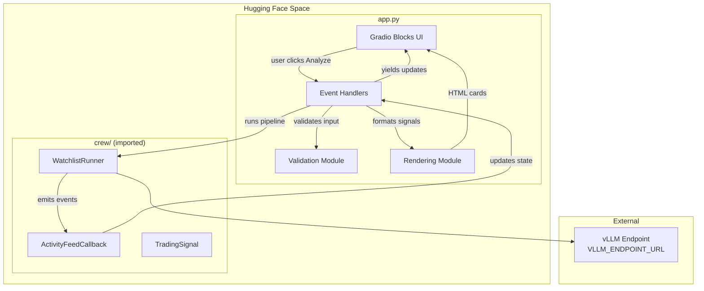
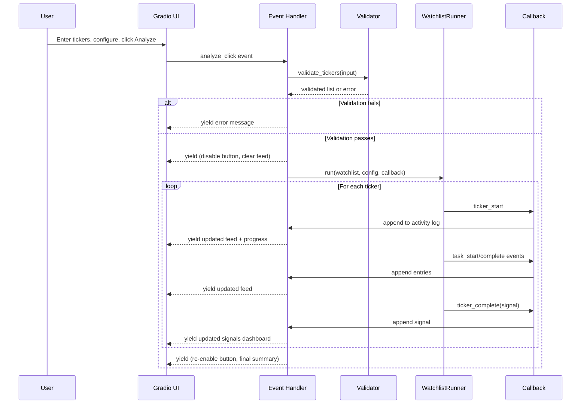
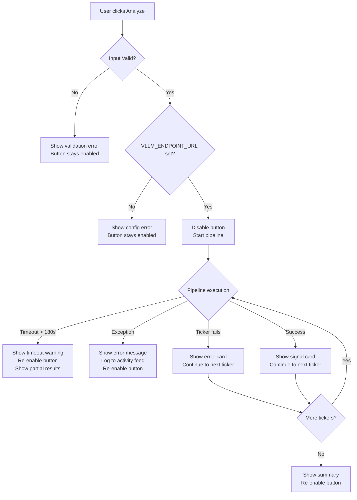

# Design Document: Gradio Frontend

## Overview

This design covers the Gradio-based web frontend for FinAgent — a financial terminal-style dashboard deployed as a Hugging Face Space. The frontend provides ticker input with validation, analysis configuration controls, a real-time agent activity feed, progress indication, and a trading signals dashboard with color-coded BUY/SELL/HOLD cards.

Key design decisions:

- **Gradio Blocks API**: Uses `gr.Blocks` for full layout control rather than `gr.Interface`, enabling custom column layouts, conditional visibility, and fine-grained event wiring
- **Generator-based streaming**: The analysis function is a Python generator that `yield`s intermediate UI state updates, enabling real-time activity feed updates without WebSocket complexity
- **Single-file architecture**: All UI code lives in `app.py` to match Hugging Face Spaces conventions — the orchestration module is imported as a package
- **HTML-rendered signal cards**: Trading signals are rendered as styled HTML strings within `gr.HTML` components, enabling full color-coding control without custom Gradio components
- **Session-scoped `gr.State`**: Per-user state (activity log, elapsed time, signals) is stored in `gr.State` objects to prevent cross-user contamination in the shared HF Space environment
- **Input validation as pure functions**: All ticker/config validation logic is extracted into pure functions for testability, separate from Gradio event handlers

## Architecture



### Application Flow



### File Structure

```
gradio-frontend/
├── app.py              # Entry point: Gradio Blocks layout + event wiring
├── validation.py       # Pure input validation functions
├── rendering.py        # HTML/CSS rendering for signal cards and feed
├── requirements.txt    # Pinned Python dependencies
└── README.md           # HF Space metadata (sdk: gradio)
```

## Components and Interfaces

### 1. Application Entry Point (`app.py`)

The main file that constructs the Gradio Blocks layout and wires events.

```python
import os
import gradio as gr
from validation import validate_tickers, validate_portfolio_value
from rendering import render_signal_card, render_summary, render_activity_entry, build_css
from crew import WatchlistRunner, OrchestratorConfig, LLMConfig


VLLM_ENDPOINT_URL = os.environ.get("VLLM_ENDPOINT_URL")


def create_app() -> gr.Blocks:
    """Build and return the Gradio Blocks application."""

    custom_css = build_css()

    with gr.Blocks(
        title="FinAgent - AI Trading Signals",
        theme=gr.themes.Base(
            primary_hue="emerald",
            neutral_hue="slate",
        ),
        css=custom_css,
    ) as app:
        # --- Header ---
        gr.Markdown("# 🤖 FinAgent\n### AI-Powered Trading Signal Generator")

        # --- Session State ---
        activity_log = gr.State([])       # list[dict] of activity entries
        signals_state = gr.State([])      # list[TradingSignal | ErrorResult]
        start_time = gr.State(None)       # float: time.time() when analysis started

        # --- Layout ---
        with gr.Row():
            # Left Column: Input Panel
            with gr.Column(scale=1):
                ticker_input = gr.Textbox(
                    label="Watchlist",
                    placeholder="AAPL, NVDA, TSLA, BTC-USD",
                    info="Comma-separated tickers (max 10)",
                )
                risk_tolerance = gr.Dropdown(
                    choices=["Conservative", "Moderate", "Aggressive"],
                    value="Moderate",
                    label="Risk Tolerance",
                )
                portfolio_value = gr.Number(
                    value=10000,
                    minimum=0,
                    label="Portfolio Value ($)",
                )
                trading_style = gr.Dropdown(
                    choices=["Day Trading", "Swing Trading", "Position Trading"],
                    value="Swing Trading",
                    label="Trading Style",
                )
                analyze_btn = gr.Button(
                    "🔍 Analyze",
                    variant="primary",
                    interactive=True,
                )
                error_display = gr.Markdown(visible=False)

            # Right Column: Activity Feed + Signals
            with gr.Column(scale=2):
                # Progress indicator
                progress_text = gr.Markdown(visible=False)

                # Activity Feed
                activity_feed = gr.HTML(
                    label="Agent Activity",
                    value="<div class='activity-feed'></div>",
                )

                # Trading Signals Dashboard
                signals_dashboard = gr.HTML(
                    label="Trading Signals",
                    value="",
                )

        # --- Footer ---
        gr.Markdown(
            "⚠️ **Disclaimer:** Trading signals are for informational purposes only "
            "and do not constitute financial advice. Always do your own research."
        )

        # --- Event Wiring ---
        analyze_btn.click(
            fn=run_analysis,
            inputs=[ticker_input, risk_tolerance, portfolio_value, trading_style,
                    activity_log, signals_state],
            outputs=[analyze_btn, error_display, progress_text,
                     activity_feed, signals_dashboard,
                     activity_log, signals_state],
        )

    return app
```

### 2. Validation Module (`validation.py`)

Pure functions for input validation — no Gradio dependencies.

```python
import re
from dataclasses import dataclass
from typing import Optional

# Valid ticker characters: letters, digits, hyphens, periods
TICKER_PATTERN = re.compile(r'^[A-Za-z0-9\-\.]+$')
MAX_TICKERS = 10


@dataclass
class ValidationResult:
    """Result of input validation."""
    valid: bool
    tickers: list[str]          # Normalized ticker list (empty if invalid)
    error_message: Optional[str]  # Human-readable error (None if valid)


def validate_tickers(raw_input: str) -> ValidationResult:
    """Validate and normalize comma-separated ticker input.

    Rules:
    - Input must not be empty
    - Each ticker is trimmed and uppercased
    - Only letters, digits, hyphens, periods allowed
    - Maximum 10 tickers per submission

    Args:
        raw_input: Raw user input string

    Returns:
        ValidationResult with normalized tickers or error message
    """
    if not raw_input or not raw_input.strip():
        return ValidationResult(
            valid=False,
            tickers=[],
            error_message="Please enter at least one ticker symbol.",
        )

    # Split and normalize
    raw_tickers = [t.strip().upper() for t in raw_input.split(",")]
    tickers = [t for t in raw_tickers if t]  # Remove empty segments

    if not tickers:
        return ValidationResult(
            valid=False,
            tickers=[],
            error_message="Please enter at least one ticker symbol.",
        )

    # Character validation
    invalid_tickers = []
    for ticker in tickers:
        if not TICKER_PATTERN.match(ticker):
            invalid_chars = set(re.findall(r'[^A-Za-z0-9\-\.]', ticker))
            invalid_tickers.append(f"{ticker} (invalid: {''.join(invalid_chars)})")

    if invalid_tickers:
        return ValidationResult(
            valid=False,
            tickers=[],
            error_message=f"Invalid characters in: {', '.join(invalid_tickers)}",
        )

    # Count validation
    if len(tickers) > MAX_TICKERS:
        return ValidationResult(
            valid=False,
            tickers=[],
            error_message=f"Maximum {MAX_TICKERS} tickers per analysis. You entered {len(tickers)}.",
        )

    return ValidationResult(valid=True, tickers=tickers, error_message=None)


def validate_portfolio_value(value: float) -> Optional[str]:
    """Validate portfolio value. Returns error message or None."""
    if value < 0:
        return "Portfolio value must be non-negative."
    return None
```

### 3. Rendering Module (`rendering.py`)

HTML/CSS generation for signal cards, activity feed, and theming.

```python
from datetime import datetime
from typing import Optional


def build_css() -> str:
    """Generate custom CSS for the dark financial terminal theme."""
    return """
    .gradio-container {
        font-family: 'JetBrains Mono', 'Fira Code', 'Courier New', monospace !important;
        background-color: #0d1117 !important;
    }
    .activity-feed {
        background: #161b22;
        border: 1px solid #30363d;
        border-radius: 6px;
        padding: 12px;
        max-height: 400px;
        overflow-y: auto;
        font-family: 'JetBrains Mono', monospace;
        font-size: 13px;
    }
    .activity-entry {
        padding: 4px 0;
        border-bottom: 1px solid #21262d;
        color: #c9d1d9;
    }
    .activity-timestamp {
        color: #8b949e;
        margin-right: 8px;
    }
    .activity-agent {
        color: #58a6ff;
        font-weight: bold;
    }
    .activity-spinner {
        color: #f0883e;
    }
    .signal-card {
        background: #161b22;
        border: 1px solid #30363d;
        border-radius: 8px;
        padding: 16px;
        margin: 8px 0;
        border-left: 4px solid;
    }
    .signal-buy { border-left-color: #3fb950; }
    .signal-sell { border-left-color: #f85149; }
    .signal-hold { border-left-color: #d29922; }
    .signal-error { border-left-color: #f85149; background: #1c0c0c; }
    .signal-ticker {
        font-size: 18px;
        font-weight: bold;
        color: #f0f6fc;
    }
    .signal-action-buy { color: #3fb950; }
    .signal-action-sell { color: #f85149; }
    .signal-action-hold { color: #d29922; }
    .signal-confidence {
        font-size: 14px;
        color: #8b949e;
    }
    .signal-prices {
        display: grid;
        grid-template-columns: repeat(3, 1fr);
        gap: 8px;
        margin-top: 8px;
    }
    .signal-price-item {
        text-align: center;
        padding: 8px;
        background: #0d1117;
        border-radius: 4px;
    }
    .signal-price-label {
        font-size: 11px;
        color: #8b949e;
        text-transform: uppercase;
    }
    .signal-price-value {
        font-size: 16px;
        color: #f0f6fc;
        font-weight: bold;
    }
    .summary-bar {
        display: flex;
        gap: 16px;
        padding: 12px;
        background: #161b22;
        border-radius: 6px;
        margin-top: 12px;
        border: 1px solid #30363d;
    }
    .summary-item {
        text-align: center;
        flex: 1;
    }
    """


def render_signal_card(signal) -> str:
    """Render a TradingSignal as an HTML card.

    Args:
        signal: TradingSignal dataclass instance

    Returns:
        HTML string for the signal card
    """
    action_lower = signal.action.value.lower()
    action_class = f"signal-{action_lower}"
    action_color_class = f"signal-action-{action_lower}"

    prices_html = ""
    if signal.entry_price or signal.stop_loss or signal.target_price:
        prices_html = f"""
        <div class="signal-prices">
            <div class="signal-price-item">
                <div class="signal-price-label">Entry</div>
                <div class="signal-price-value">${signal.entry_price:.2f if signal.entry_price else 'N/A'}</div>
            </div>
            <div class="signal-price-item">
                <div class="signal-price-label">Stop Loss</div>
                <div class="signal-price-value">${signal.stop_loss:.2f if signal.stop_loss else 'N/A'}</div>
            </div>
            <div class="signal-price-item">
                <div class="signal-price-label">Target</div>
                <div class="signal-price-value">${signal.target_price:.2f if signal.target_price else 'N/A'}</div>
            </div>
        </div>
        """

    reasoning_html = ""
    if signal.reasoning:
        reasoning_items = "".join(
            f"<li><strong>{k}:</strong> {v}</li>"
            for k, v in signal.reasoning.items()
        )
        reasoning_html = f"<ul style='color:#c9d1d9;margin-top:8px;'>{reasoning_items}</ul>"

    return f"""
    <div class="signal-card {action_class}">
        <div style="display:flex;justify-content:space-between;align-items:center;">
            <span class="signal-ticker">{signal.ticker}</span>
            <span class="{action_color_class}" style="font-size:20px;font-weight:bold;">
                {signal.action.value}
            </span>
        </div>
        <div class="signal-confidence">Confidence: {signal.confidence}%</div>
        {prices_html}
        {reasoning_html}
    </div>
    """


def render_error_card(ticker: str, error_message: str) -> str:
    """Render an error card for a failed ticker analysis."""
    return f"""
    <div class="signal-card signal-error">
        <div class="signal-ticker">{ticker}</div>
        <div style="color:#f85149;margin-top:4px;">⚠️ Analysis failed: {error_message}</div>
    </div>
    """


def render_summary(total: int, buy_count: int, sell_count: int, hold_count: int) -> str:
    """Render the aggregate summary bar."""
    return f"""
    <div class="summary-bar">
        <div class="summary-item">
            <div style="font-size:24px;color:#f0f6fc;">{total}</div>
            <div style="font-size:11px;color:#8b949e;">ANALYZED</div>
        </div>
        <div class="summary-item">
            <div style="font-size:24px;color:#3fb950;">{buy_count}</div>
            <div style="font-size:11px;color:#8b949e;">BUY</div>
        </div>
        <div class="summary-item">
            <div style="font-size:24px;color:#f85149;">{sell_count}</div>
            <div style="font-size:11px;color:#8b949e;">SELL</div>
        </div>
        <div class="summary-item">
            <div style="font-size:24px;color:#d29922;">{hold_count}</div>
            <div style="font-size:11px;color:#8b949e;">HOLD</div>
        </div>
    </div>
    """


def render_activity_entry(
    timestamp: datetime,
    agent_name: str,
    message: str,
    is_spinner: bool = False,
) -> str:
    """Render a single activity feed entry as HTML."""
    time_str = timestamp.strftime("%H:%M:%S")
    spinner = '<span class="activity-spinner"> ⟳</span>' if is_spinner else ""
    return f"""
    <div class="activity-entry">
        <span class="activity-timestamp">[{time_str}]</span>
        <span class="activity-agent">{agent_name}</span>{spinner}
        <span>{message}</span>
    </div>
    """


def render_activity_feed(entries: list[str]) -> str:
    """Wrap activity entries in the feed container with auto-scroll script."""
    entries_html = "\n".join(entries)
    return f"""
    <div class="activity-feed" id="activity-feed">
        {entries_html}
    </div>
    <script>
        var feed = document.getElementById('activity-feed');
        if (feed) feed.scrollTop = feed.scrollHeight;
    </script>
    """
```

### 4. Event Handler (`app.py` — generator function)

The core analysis handler that yields intermediate state updates.

```python
import time
from datetime import datetime
from typing import Generator
from crew import WatchlistRunner, OrchestratorConfig, LLMConfig, CrewConfig
from crew.callbacks import ActivityFeedCallback, ActivityEvent, EventType
from crew.signals import TradingSignal, Action
from validation import validate_tickers, validate_portfolio_value
from rendering import (
    render_signal_card, render_error_card, render_summary,
    render_activity_entry, render_activity_feed,
)


TIMEOUT_SECONDS = 180


def run_analysis(
    ticker_input: str,
    risk_tolerance: str,
    portfolio_value: float,
    trading_style: str,
    activity_log: list,
    signals_state: list,
) -> Generator:
    """Generator function that streams analysis updates to the UI.

    Yields tuples of:
        (analyze_btn, error_display, progress_text,
         activity_feed, signals_dashboard,
         activity_log, signals_state)
    """
    # --- Validate environment ---
    if not VLLM_ENDPOINT_URL:
        yield (
            gr.update(interactive=True),                    # analyze_btn
            gr.update(value="❌ Configuration error: `VLLM_ENDPOINT_URL` environment variable is not set.", visible=True),
            gr.update(visible=False),                      # progress_text
            gr.update(),                                   # activity_feed
            gr.update(),                                   # signals_dashboard
            activity_log,
            signals_state,
        )
        return

    # --- Validate input ---
    validation = validate_tickers(ticker_input)
    if not validation.valid:
        yield (
            gr.update(interactive=True),
            gr.update(value=f"❌ {validation.error_message}", visible=True),
            gr.update(visible=False),
            gr.update(),
            gr.update(),
            activity_log,
            signals_state,
        )
        return

    portfolio_error = validate_portfolio_value(portfolio_value)
    if portfolio_error:
        yield (
            gr.update(interactive=True),
            gr.update(value=f"❌ {portfolio_error}", visible=True),
            gr.update(visible=False),
            gr.update(),
            gr.update(),
            activity_log,
            signals_state,
        )
        return

    # --- Initialize state ---
    activity_log = []
    signals_state = []
    analysis_start = time.time()
    tickers = validation.tickers
    total = len(tickers)

    # Initial yield: disable button, clear errors, show progress
    start_entry = render_activity_entry(
        datetime.now(), "System", f"Analysis started for {total} ticker(s)", False
    )
    activity_log.append(start_entry)

    yield (
        gr.update(interactive=False),                      # disable button
        gr.update(visible=False),                          # hide error
        gr.update(value=f"**Analyzing ticker 1 of {total}**", visible=True),
        render_activity_feed(activity_log),
        "",                                                # clear signals
        activity_log,
        signals_state,
    )

    # --- Configure and run pipeline ---
    config = OrchestratorConfig(
        llm=LLMConfig(base_url=VLLM_ENDPOINT_URL),
    )

    # Event collection queue (populated by callback)
    pending_events: list[ActivityEvent] = []

    def event_handler(event: ActivityEvent):
        pending_events.append(event)

    callback = ActivityFeedCallback(handler=event_handler)

    try:
        runner = WatchlistRunner(config=config, tools={}, callback=callback)

        for i, ticker in enumerate(tickers, 1):
            # Check timeout
            elapsed = time.time() - analysis_start
            if elapsed > TIMEOUT_SECONDS:
                timeout_entry = render_activity_entry(
                    datetime.now(), "System",
                    f"⚠️ Analysis timed out after {TIMEOUT_SECONDS}s", False
                )
                activity_log.append(timeout_entry)
                yield (
                    gr.update(interactive=True),
                    gr.update(value="⚠️ Analysis timed out. Try fewer tickers.", visible=True),
                    gr.update(visible=False),
                    render_activity_feed(activity_log),
                    _render_signals_dashboard(signals_state),
                    activity_log,
                    signals_state,
                )
                return

            # Update progress
            elapsed_str = f"{int(elapsed)}s"
            progress_msg = f"**Analyzing ticker {i} of {total}** — {ticker} (elapsed: {elapsed_str})"

            # Run single ticker
            result = runner._run_single(ticker)

            # Process pending events
            for event in pending_events:
                entry = render_activity_entry(
                    event.timestamp, event.agent_name, event.message,
                    is_spinner=(event.event_type == EventType.TASK_START),
                )
                activity_log.append(entry)
            pending_events.clear()

            # Collect signal
            if result.success and result.signal:
                signals_state.append(result.signal)
            else:
                signals_state.append({"ticker": ticker, "error": result.error or "Unknown error"})

            # Yield intermediate update
            yield (
                gr.update(interactive=False),
                gr.update(visible=False),
                gr.update(value=progress_msg, visible=True),
                render_activity_feed(activity_log),
                _render_signals_dashboard(signals_state),
                activity_log,
                signals_state,
            )

    except Exception as e:
        error_entry = render_activity_entry(
            datetime.now(), "System", f"❌ Error: {str(e)}", False
        )
        activity_log.append(error_entry)
        yield (
            gr.update(interactive=True),
            gr.update(value=f"❌ An error occurred: {str(e)}", visible=True),
            gr.update(visible=False),
            render_activity_feed(activity_log),
            _render_signals_dashboard(signals_state),
            activity_log,
            signals_state,
        )
        return

    # --- Final yield: re-enable button, show completion ---
    elapsed_total = time.time() - analysis_start
    complete_entry = render_activity_entry(
        datetime.now(), "System",
        f"✅ Analysis complete ({int(elapsed_total)}s)", False
    )
    activity_log.append(complete_entry)

    yield (
        gr.update(interactive=True),
        gr.update(visible=False),
        gr.update(visible=False),
        render_activity_feed(activity_log),
        _render_signals_dashboard(signals_state),
        activity_log,
        signals_state,
    )


def _render_signals_dashboard(signals: list) -> str:
    """Render all signal cards plus summary."""
    if not signals:
        return ""

    cards = []
    buy_count = sell_count = hold_count = 0

    for item in signals:
        if isinstance(item, dict) and "error" in item:
            cards.append(render_error_card(item["ticker"], item["error"]))
        else:
            cards.append(render_signal_card(item))
            if item.action == Action.BUY:
                buy_count += 1
            elif item.action == Action.SELL:
                sell_count += 1
            else:
                hold_count += 1

    total = len(signals)
    summary = render_summary(total, buy_count, sell_count, hold_count)

    return summary + "\n".join(cards)
```

### 5. Application Launch

```python
# Bottom of app.py
if __name__ == "__main__":
    app = create_app()
    app.launch(server_name="0.0.0.0")
```

## Data Models

### ValidationResult

```python
@dataclass
class ValidationResult:
    valid: bool                     # Whether input passed all checks
    tickers: list[str]             # Normalized uppercase ticker list
    error_message: Optional[str]   # Human-readable error or None
```

### UI State (per session via gr.State)

| State Variable  | Type                          | Purpose                                   |
| --------------- | ----------------------------- | ----------------------------------------- |
| `activity_log`  | `list[str]`                   | HTML strings for each activity feed entry |
| `signals_state` | `list[TradingSignal \| dict]` | Collected signals or error dicts          |
| `start_time`    | `Optional[float]`             | `time.time()` when analysis began         |

### Signal Card Data (from orchestration module)

```python
# Re-used from crew/signals.py
@dataclass
class TradingSignal:
    ticker: str              # "AAPL"
    action: Action           # BUY | SELL | HOLD
    confidence: int          # 0-100
    entry_price: float       # 185.42
    stop_loss: float         # 180.55
    target_price: float      # 192.17
    reasoning: dict[str, str]  # {"Market Scanner": "...", ...}
```

### Error Card Data

```python
# Inline dict when a ticker fails
{"ticker": "AAPL", "error": "Connection timeout to vLLM endpoint"}
```

### Configuration (Environment Variables)

| Variable            | Required | Description                                                       |
| ------------------- | -------- | ----------------------------------------------------------------- |
| `VLLM_ENDPOINT_URL` | Yes      | Full URL to vLLM inference endpoint (e.g., `http://host:8000/v1`) |

### requirements.txt

```
gradio==4.44.1
crewai==0.80.0
langchain-openai==0.2.14
```

## Correctness Properties

_A property is a characteristic or behavior that should hold true across all valid executions of a system — essentially, a formal statement about what the system should do. Properties serve as the bridge between human-readable specifications and machine-verifiable correctness guarantees._

### Property 1: Ticker normalization preserves content

_For any_ comma-separated string of valid ticker symbols (containing only letters, digits, hyphens, and periods) with arbitrary leading/trailing whitespace and mixed case, `validate_tickers` SHALL return a list where each ticker is the trimmed, uppercase version of the corresponding input segment, and the count of returned tickers equals the number of non-empty segments.

**Validates: Requirements 1.3**

### Property 2: Empty and whitespace-only input is rejected

_For any_ string composed entirely of whitespace characters (including the empty string), `validate_tickers` SHALL return `valid=False` with a non-empty error message and an empty tickers list.

**Validates: Requirements 1.2**

### Property 3: Invalid characters are detected and reported

_For any_ ticker string containing at least one character outside the set `[A-Za-z0-9\-\.]`, `validate_tickers` SHALL return `valid=False` with an error message that contains at least one of the invalid characters found in the input.

**Validates: Requirements 1.4**

### Property 4: Maximum ticker count is enforced

_For any_ list of more than 10 valid ticker symbols (joined by commas), `validate_tickers` SHALL return `valid=False` with an error message mentioning the maximum limit.

**Validates: Requirements 1.5**

### Property 5: Activity entry rendering includes timestamp, agent name, and spinner control

_For any_ datetime timestamp, non-empty agent name string, non-empty message string, and boolean `is_spinner` flag, `render_activity_entry` SHALL produce an HTML string that contains: (a) the formatted timestamp, (b) the agent name, (c) the message content, and (d) a spinner element if and only if `is_spinner` is True.

**Validates: Requirements 3.1, 3.2, 3.3, 3.4**

### Property 6: Progress message contains ticker name and position

_For any_ ticker string, position `i` (1-indexed), and total count `M` where `1 <= i <= M`, the progress message SHALL contain both the ticker name and the string representation of `i` and `M`.

**Validates: Requirements 4.2, 4.3**

### Property 7: Signal card renders all fields with correct action color class

_For any_ valid TradingSignal with action in {BUY, SELL, HOLD}, confidence in [0, 100], and non-negative prices, `render_signal_card` SHALL produce HTML that contains: (a) the ticker name, (b) the action text, (c) the confidence value, (d) entry/stop-loss/target prices, and (e) the CSS class `signal-buy` for BUY, `signal-sell` for SELL, or `signal-hold` for HOLD.

**Validates: Requirements 5.1, 5.2, 5.4**

### Property 8: Summary counts are consistent with signal list

_For any_ list of TradingSignal objects, `render_summary` SHALL display counts where `buy_count + sell_count + hold_count == total`, and each count matches the number of signals with the corresponding action in the input list.

**Validates: Requirements 5.3**

### Property 9: Error card contains ticker and error message

_For any_ non-empty ticker string and non-empty error message string, `render_error_card` SHALL produce HTML that contains both the ticker name and the error message text.

**Validates: Requirements 5.5**

### Property 10: Exception handling yields re-enabled button and error display

_For any_ exception raised during pipeline execution, the `run_analysis` generator SHALL yield a final state where the Analyze button is interactive (re-enabled) and an error message is visible in either the error display or the activity feed.

**Validates: Requirements 8.1, 8.3**

## Error Handling

### Error Handling Strategy

The frontend uses a **defensive layering** approach with three error boundaries:

1. **Input validation layer** — catches malformed input before any pipeline execution
2. **Pipeline execution layer** — wraps the entire WatchlistRunner call in try/except
3. **Per-ticker isolation** — inherited from the orchestration module's fault-isolated loop

### Error Flow



### Error Categories

| Error Category          | Detection                                | User-Facing Message                               | Recovery                 |
| ----------------------- | ---------------------------------------- | ------------------------------------------------- | ------------------------ |
| Empty input             | `validate_tickers` returns `valid=False` | "Please enter at least one ticker symbol."        | User corrects input      |
| Invalid characters      | `validate_tickers` regex check           | "Invalid characters in: AAPL$ (invalid: $)"       | User corrects input      |
| Too many tickers        | `len(tickers) > 10`                      | "Maximum 10 tickers per analysis. You entered N." | User reduces list        |
| Missing env var         | `VLLM_ENDPOINT_URL is None`              | "Configuration error: VLLM_ENDPOINT_URL not set." | Admin sets env var       |
| vLLM connection failure | `ConnectionError` from runner            | "Inference service unavailable. Check endpoint."  | Retry later              |
| Network timeout         | `elapsed > 180s`                         | "Analysis timed out. Try fewer tickers."          | Retry with fewer tickers |
| Pipeline exception      | `except Exception` in handler            | "An error occurred: {message}"                    | Retry                    |
| Single ticker failure   | `CrewResult.success=False`               | Error card: "Analysis failed: {reason}"           | Other tickers unaffected |

### Button State Invariant

The Analyze button follows a strict state machine:

- **Enabled** → User clicks → **Disabled** (first yield)
- **Disabled** → Pipeline completes OR error occurs → **Enabled** (final yield)
- The button is NEVER left in a disabled state after the generator completes

## Testing Strategy

### Property-Based Testing

This feature is suitable for property-based testing because:

- The validation module contains pure functions with clear input/output behavior
- The rendering module transforms structured data into HTML strings — universal properties hold across all inputs
- The input space is large (arbitrary strings, ticker combinations, signal values)

**Library**: [Hypothesis](https://hypothesis.readthedocs.io/) (Python PBT library)

**Configuration**:

- Minimum 100 examples per property test (`@settings(max_examples=100)`)
- Each test tagged with: `# Feature: gradio-frontend, Property N: {property_text}`

**Property tests to implement**:

1. Ticker normalization (Property 1)
2. Whitespace rejection (Property 2)
3. Invalid character detection (Property 3)
4. Max ticker enforcement (Property 4)
5. Activity entry rendering (Property 5)
6. Progress message format (Property 6)
7. Signal card completeness + color coding (Property 7)
8. Summary count invariant (Property 8)
9. Error card rendering (Property 9)
10. Exception handling button state (Property 10)

### Unit Tests (Example-Based)

Unit tests cover specific scenarios, UI structure checks, and integration points:

- **UI structure**: Verify Gradio components exist with correct labels, choices, defaults
- **Environment handling**: Test behavior when `VLLM_ENDPOINT_URL` is set vs unset
- **Auto-scroll**: Verify `render_activity_feed` includes scroll JavaScript
- **Timeout behavior**: Mock `time.time()` to trigger 180s timeout path
- **vLLM connection error**: Mock runner to raise `ConnectionError`, verify message
- **Disclaimer presence**: Verify footer contains disclaimer text
- **Dark theme**: Verify CSS contains dark background colors

### Integration Tests

- **End-to-end flow**: Mock `WatchlistRunner` to return canned signals, verify full generator output sequence
- **Multi-ticker partial failure**: One ticker succeeds, one fails — verify both cards render correctly
- **Callback event processing**: Verify `ActivityFeedCallback` events translate to correct activity feed entries

### Test File Structure

```
tests/
├── test_validation.py          # Property + unit tests for validation.py
├── test_rendering.py           # Property + unit tests for rendering.py
├── test_handler.py             # Integration tests for run_analysis generator
└── conftest.py                 # Shared fixtures (mock signals, mock runner)
```
