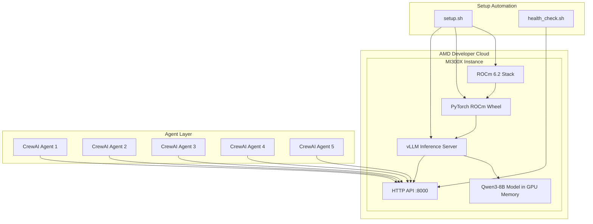
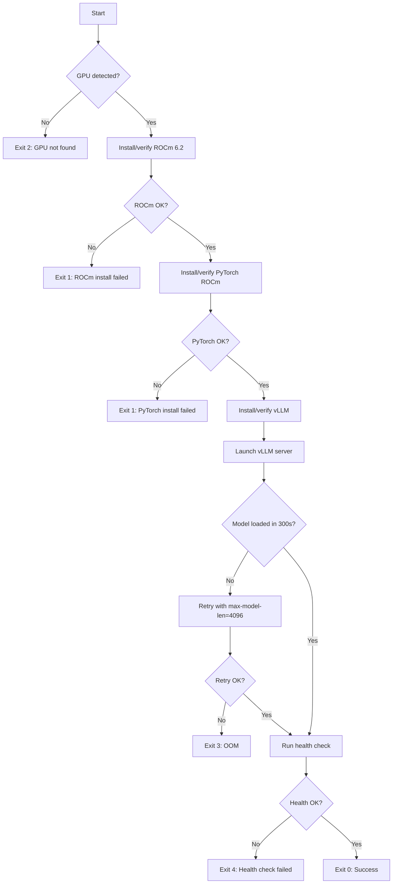

# Design Document: Inference Setup

## Overview

This design covers the infrastructure and automation layer for deploying a high-performance LLM inference endpoint on AMD MI300X hardware. The system provisions an AMD Developer Cloud instance, installs the ROCm 6.2 GPU compute stack, deploys a Qwen3 model via vLLM, and exposes an OpenAI-compatible API endpoint that CrewAI agents consume.

The design prioritizes:

- **Reproducibility**: A single idempotent Bash script rebuilds the full stack from scratch
- **Reliability**: Health checks, timeouts, and fallback model switching ensure uptime
- **Performance**: vLLM's continuous batching and PagedAttention on MI300X deliver <30s latency for single requests and <60s for 5 concurrent agents

## Architecture



### Layer Breakdown

| Layer      | Component                      | Responsibility                                    |
| ---------- | ------------------------------ | ------------------------------------------------- |
| Hardware   | MI300X GPU (192GB HBM3)        | Raw compute for tensor operations                 |
| Platform   | ROCm 6.2 (drivers + runtime)   | GPU access, memory management                     |
| Framework  | PyTorch (ROCm wheel)           | Tensor operations, model loading                  |
| Serving    | vLLM (ROCm backend)            | Continuous batching, PagedAttention, HTTP serving |
| API        | `/v1/chat/completions`         | OpenAI-compatible request/response interface      |
| Automation | `setup.sh` + `health_check.sh` | Reproducible provisioning and verification        |

## Components and Interfaces

### 1. Setup Script (`setup.sh`)

The main automation entry point. Orchestrates the full provisioning sequence.

**Interface:**

```bash
./setup.sh [--model MODEL_NAME] [--host HOST] [--port PORT] [--max-model-len MAX_LEN]
```

**Parameters:**
| Parameter | Default | Description |
|-----------|---------|-------------|
| `--model` | `Qwen/Qwen3-8B` | HuggingFace model identifier |
| `--host` | `0.0.0.0` | Bind address for vLLM server |
| `--port` | `8000` | Listening port |
| `--max-model-len` | `32768` | Maximum context length (tokens) |

**Exit Codes:**

- `0`: Success — server running and health check passed
- `1`: General failure
- `2`: GPU not detected
- `3`: Model load failure (OOM)
- `4`: Health check failure
- `5`: Timeout

**Execution Flow:**



### 2. vLLM Inference Server

The core serving component. Runs as a background process managed by the setup script.

**Launch Command:**

```bash
python -m vllm.entrypoints.openai.api_server \
    --model "${MODEL_NAME}" \
    --host "${HOST}" \
    --port "${PORT}" \
    --max-model-len "${MAX_MODEL_LEN}" \
    --tensor-parallel-size 1 \
    --gpu-memory-utilization 0.90 \
    --max-num-seqs 8 \
    --dtype auto \
    --trust-remote-code
```

**Key Configuration:**
| Parameter | Value | Rationale |
|-----------|-------|-----------|
| `--tensor-parallel-size` | 1 | Single MI300X has 192GB — sufficient for 8B/14B |
| `--gpu-memory-utilization` | 0.90 | Reserve 10% for KV cache overhead spikes |
| `--max-num-seqs` | 8 | Support 5 concurrent agents + 3 queued |
| `--dtype auto` | auto | Let vLLM pick optimal dtype (bfloat16 on MI300X) |

### 3. Health Check (`health_check.sh`)

A standalone verification script that validates the endpoint is operational.

**Interface:**

```bash
./health_check.sh [--host HOST] [--port PORT] [--timeout SECONDS]
```

**Behavior:**

1. Sends a POST to `http://{host}:{port}/v1/chat/completions` with a short test prompt
2. Validates HTTP 200, non-empty `choices[0].message.content`, and response time
3. Reports latency in milliseconds on success
4. Reports error details on failure

**Request Payload:**

```json
{
  "model": "<detected-model>",
  "messages": [{ "role": "user", "content": "Say hello." }],
  "max_tokens": 50,
  "temperature": 0.1
}
```

### 4. Fallback Model Switcher

Integrated into `setup.sh` via the `--model` parameter. Handles model selection and memory validation.

**Supported Models:**
| Model | HuggingFace ID | Min GPU Memory (GB) | Context Length |
|-------|---------------|---------------------|----------------|
| Qwen3-14B | `Qwen/Qwen3-14B` | ~32 | 32768 |
| Qwen3-8B | `Qwen/Qwen3-8B` | ~18 | 32768 |
| Qwen3-4B | `Qwen/Qwen3-4B` | ~10 | 32768 |
| Qwen3-1.7B | `Qwen/Qwen3-1.7B` | ~5 | 32768 |

**Memory Check Logic:**

```bash
available_mem=$(rocm-smi --showmeminfo vram --json | jq '.card0.VRAM_Total' )
# Compare against model requirements, suggest largest fitting model if OOM
```

## Data Models

### Chat Completion Request (OpenAI-compatible)

```json
{
  "model": "Qwen/Qwen3-8B",
  "messages": [
    { "role": "system", "content": "You are a financial analyst." },
    { "role": "user", "content": "Analyze AAPL earnings." }
  ],
  "temperature": 0.7,
  "max_tokens": 512
}
```

**Field Constraints:**
| Field | Type | Required | Constraints |
|-------|------|----------|-------------|
| `model` | string | Yes | Must match loaded model name |
| `messages` | array | Yes | Non-empty; each item has `role` and `content` |
| `messages[].role` | string | Yes | One of: `system`, `user`, `assistant` |
| `messages[].content` | string | Yes | Non-empty string |
| `temperature` | float | No | 0.0–2.0, default 1.0 |
| `max_tokens` | integer | No | 1–32768 |

### Chat Completion Response

```json
{
  "id": "chatcmpl-abc123",
  "object": "chat.completion",
  "created": 1700000000,
  "model": "Qwen/Qwen3-8B",
  "choices": [
    {
      "index": 0,
      "message": {
        "role": "assistant",
        "content": "Based on AAPL's latest earnings..."
      },
      "finish_reason": "stop"
    }
  ],
  "usage": {
    "prompt_tokens": 25,
    "completion_tokens": 128,
    "total_tokens": 153
  }
}
```

### Setup Script Configuration (Environment Variables / CLI Args)

| Variable           | CLI Flag          | Default         | Description            |
| ------------------ | ----------------- | --------------- | ---------------------- |
| `FINAGENT_MODEL`   | `--model`         | `Qwen/Qwen3-8B` | Model to deploy        |
| `FINAGENT_HOST`    | `--host`          | `0.0.0.0`       | Server bind address    |
| `FINAGENT_PORT`    | `--port`          | `8000`          | Server port            |
| `FINAGENT_MAX_LEN` | `--max-model-len` | `32768`         | Max context length     |
| `VLLM_VERSION`     | —                 | `0.6.3`         | Pinned vLLM version    |
| `TORCH_VERSION`    | —                 | `2.4.0+rocm6.2` | Pinned PyTorch version |
| `ROCM_VERSION`     | —                 | `6.2`           | Pinned ROCm version    |

### Health Check Result

```json
{
  "status": "healthy|unhealthy",
  "latency_ms": 1250,
  "model": "Qwen/Qwen3-8B",
  "error": null
}
```

## Correctness Properties

_A property is a characteristic or behavior that should hold true across all valid executions of a system — essentially, a formal statement about what the system should do. Properties serve as the bridge between human-readable specifications and machine-verifiable correctness guarantees._

### Property 1: Health check reports failure for any non-200 status code

_For any_ HTTP status code that is not 200 (including all 4xx and 5xx codes), when the API endpoint returns that status code with any error body, the health check SHALL report failure including the exact status code and the error body content, and exit with a non-zero exit code.

**Validates: Requirements 8.4**

### Property 2: Invalid model name rejection with informative error

_For any_ string that is not in the supported model set {Qwen3-14B, Qwen3-8B, Qwen3-4B, Qwen3-1.7B}, the setup script SHALL reject the input, exit with a non-zero exit code, and produce an error message that contains both the invalid value provided and the complete list of supported model variants.

**Validates: Requirements 9.1, 9.4**

### Property 3: Memory-aware model suggestion selects largest fitting model

_For any_ available GPU memory value (in GB), when the specified model exceeds that memory, the setup script SHALL suggest the largest supported model variant whose minimum memory requirement is less than or equal to the available memory. If no model fits, it SHALL report that no supported model can run.

**Validates: Requirements 9.5**

## Error Handling

### Error Handling Strategy

The system uses a **fail-fast with informative diagnostics** approach. Each component has clear error boundaries and reports failures with enough context to diagnose issues quickly during a hackathon.

### Setup Script Error Handling

| Error Condition         | Detection Method                     | Response                                     | Exit Code |
| ----------------------- | ------------------------------------ | -------------------------------------------- | --------- |
| GPU not detected        | `rocm-smi` returns no devices        | Print error to stderr, halt                  | 2         |
| ROCm install failure    | Non-zero exit from package manager   | Print step name + error to stderr, halt      | 1         |
| PyTorch install failure | Non-zero exit from pip               | Print step name + error to stderr, halt      | 1         |
| vLLM install failure    | Non-zero exit from pip               | Print step name + error to stderr, halt      | 1         |
| Model load OOM          | vLLM stderr contains "out of memory" | Retry with `--max-model-len 4096`, then fail | 3         |
| Model load timeout      | 300s elapsed without ready log       | Kill vLLM process, print timeout error       | 5         |
| Invalid model name      | Not in supported set                 | Print invalid value + supported list         | 1         |
| Health check failure    | Non-zero exit from health_check.sh   | Print health check output                    | 4         |

### Health Check Error Handling

| Error Condition     | Detection Method                      | Response                                    | Exit Code |
| ------------------- | ------------------------------------- | ------------------------------------------- | --------- |
| Connection refused  | `curl` exit code 7                    | Print "Connection refused at {host}:{port}" | 1         |
| Network unreachable | `curl` exit code 6/28                 | Print "Network unreachable"                 | 1         |
| Timeout (30s)       | `curl --max-time 30` timeout          | Print "Timeout: no response within 30s"     | 2         |
| Non-200 response    | HTTP status != 200                    | Print status code + response body           | 3         |
| Empty response body | `choices[0].message.content` is empty | Print "Empty response from model"           | 4         |

### vLLM Server Error Handling (Managed by vLLM)

| Error Condition            | vLLM Behavior                          | Our Script's Role      |
| -------------------------- | -------------------------------------- | ---------------------- |
| Invalid request fields     | Returns HTTP 422 with validation error | None (vLLM handles)    |
| Unknown model name         | Returns HTTP 404                       | None (vLLM handles)    |
| Request timeout (60s)      | Terminates request, returns error      | None (vLLM handles)    |
| Queue overflow (120s wait) | Returns timeout to client              | None (vLLM handles)    |
| GPU memory pressure        | vLLM manages KV cache eviction         | Monitor via `rocm-smi` |

### Idempotency Guarantees

The setup script is designed to be re-runnable:

- Package installations use `--no-reinstall` / version checks before installing
- vLLM server launch checks if a process is already running on the target port
- If server is already running and healthy, script skips launch and runs health check only
- All state checks happen before mutations

## Testing Strategy

### Testing Approach

This feature uses a **dual testing approach**:

- **Property-based tests** for the pure logic components (model validation, memory-based suggestion, health check response parsing)
- **Integration tests** for end-to-end verification on actual MI300X hardware
- **Smoke tests** for one-time configuration verification

### Property-Based Tests

**Library:** [Hypothesis](https://hypothesis.readthedocs.io/) (Python) for testing the validation and suggestion logic extracted into testable Python functions.

**Configuration:** Minimum 100 iterations per property test.

| Property   | Test Description                                                                           | Tag                                                                                               |
| ---------- | ------------------------------------------------------------------------------------------ | ------------------------------------------------------------------------------------------------- |
| Property 1 | Generate random HTTP status codes (4xx, 5xx) and error bodies; verify health check output  | Feature: inference-setup, Property 1: Health check reports failure for any non-200 status code    |
| Property 2 | Generate random strings; verify rejection + error message content for non-supported values | Feature: inference-setup, Property 2: Invalid model name rejection with informative error         |
| Property 3 | Generate random memory values (0–200 GB); verify largest fitting model is suggested        | Feature: inference-setup, Property 3: Memory-aware model suggestion selects largest fitting model |

### Unit Tests (Example-Based)

| Test                        | Validates | Description                                           |
| --------------------------- | --------- | ----------------------------------------------------- |
| Valid model names accepted  | 9.1       | Test each of the 4 supported model names is accepted  |
| Default model is Qwen3-8B   | 9.1       | Test no --model flag defaults to Qwen3-8B             |
| Health check success path   | 8.2       | Mock 200 response, verify success report with latency |
| Health check request format | 8.1       | Verify request payload has correct structure          |
| Script idempotency          | 7.3       | Run setup twice, verify second run succeeds           |
| PyTorch wheel selection     | 2.3       | Verify correct wheel for Python 3.10 and 3.11         |
| Exit code 0 on success      | 7.7       | Verify successful run exits with 0                    |

### Integration Tests (On MI300X Hardware)

| Test                       | Validates | Description                                     |
| -------------------------- | --------- | ----------------------------------------------- |
| Full setup from fresh      | 7.1, 7.2  | Run setup.sh on fresh instance, verify <30 min  |
| ROCm GPU detection         | 2.2       | Verify `rocm-smi` detects MI300X after install  |
| PyTorch GPU access         | 2.4       | Verify `torch.cuda.is_available()` returns True |
| Single request latency     | 6.1       | 1024-token request completes in <30s            |
| Concurrent request latency | 6.2       | 5 concurrent requests complete in <60s          |
| TTFT measurement           | 6.3       | First token arrives in <2s on idle server       |
| Response schema validation | 4.3, 4.4  | Verify response contains all required fields    |
| 5 concurrent agents        | 5.1, 5.2  | 5 simultaneous requests all return 200          |
| Response isolation         | 5.3       | Concurrent requests don't leak content          |
| Request validation (422)   | 4.6       | Malformed requests return 422                   |
| Wrong model name (404)     | 4.7       | Non-loaded model returns 404                    |
| Fallback model serving     | 9.3       | Deploy Qwen3-4B, verify same endpoint works     |

### Smoke Tests

| Test                       | Validates | Description                                    |
| -------------------------- | --------- | ---------------------------------------------- |
| Pinned versions in script  | 7.4       | Grep script for version pins                   |
| Memory docs present        | 9.2       | Verify fallback memory requirements documented |
| SSH access after provision | 1.2       | Verify port 22 reachable                       |

### Test Execution Order

1. **Smoke tests** — fast, no hardware needed (CI)
2. **Property tests** — fast, no hardware needed (CI)
3. **Unit tests** — fast, mocked dependencies (CI)
4. **Integration tests** — require MI300X instance (manual/scheduled)
