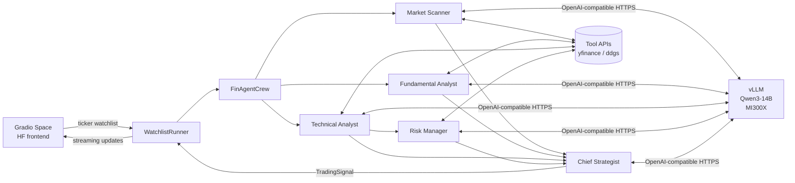

# FinAgent

**AI-powered trading signal generator. Five specialist agents collaborate on a single AMD Instinct MI300X to produce structured BUY / SELL / HOLD calls with confidence, entry, stop loss, target, and per-agent reasoning.**

Built for the [AMD Developer Hackathon](https://lablab.ai/ai-hackathons/amd-developer) · Track: **AI Agents & Agentic Workflows** · May 2026.

|               |                                                                            |
| ------------- | -------------------------------------------------------------------------- |
| **Live demo** | <https://huggingface.co/spaces/lablab-ai-amd-developer-hackathon/finagent> |
| **Track**     | AI Agents & Agentic Workflows                                              |
| **Model**     | Qwen/Qwen3-14B via vLLM 0.17 on ROCm 7.2                                   |
| **Hardware**  | AMD Instinct MI300X (AMD Developer Cloud)                                  |
| **License**   | MIT                                                                        |

---

## The problem

Retail traders juggling a watchlist face a daily triage problem: which of these 10 tickers deserves real attention today? Most AI tools answer this with a single-shot prompt into a general-purpose model — the output is confident, shallow, and indistinguishable across tickers.

Real analysts don't work that way. They split the work: one person reads the news, another digs into financials, another reads charts, another sizes the trade. Then a head of strategy synthesizes.

## The solution

FinAgent reproduces that division of labour with five CrewAI agents running against a **single locally-hosted Qwen3-14B instance on an AMD MI300X GPU**. Each agent is tool-equipped for its niche; they run in a dependency-correct topology (scanner + fundamental + technical first, then risk, then strategy), and the final output conforms to a strict schema that the Gradio frontend parses into interactive signal cards.

Everything is **self-hosted inference** — no OpenAI, no Claude, no API bills. The $100 AMD Developer Cloud credit is the entire compute budget.

---

## Architecture



| Layer              | Role                                                                  | Spec                  |
| ------------------ | --------------------------------------------------------------------- | --------------------- |
| `inference/`       | Bash-driven ROCm + vLLM + Qwen3 deployment on MI300X                  | `inference-setup`     |
| `tools/`           | 10 keyless tool functions (yfinance, ddgs, pandas-ta) agents can call | `agent-tools`         |
| `crew/`            | CrewAI agent + task + crew + runner orchestration, with callbacks     | `agent-orchestration` |
| `gradio-frontend/` | Dark financial-terminal Gradio UI, deployable as an HF Space          | `gradio-frontend`     |

## The five agents

| #   | Agent                   | Goal                                      | Tools                                           |
| --- | ----------------------- | ----------------------------------------- | ----------------------------------------------- |
| 1   | **Market Scanner**      | Detect news and price/volume anomalies    | `search_news`, `get_price_change`, `get_volume` |
| 2   | **Fundamental Analyst** | Determine intrinsic value                 | `get_financials`, `get_earnings`, `get_peers`   |
| 3   | **Technical Analyst**   | Identify entry/exit via indicators        | `get_price_history`, `calculate_indicators`     |
| 4   | **Risk Manager**        | Size position, place ATR-based stop-loss  | `calculate_position_size`, `set_stop_loss`      |
| 5   | **Chief Strategist**    | Synthesize 1–4 into a final BUY/SELL/HOLD | — pure reasoning                                |

Agents 1, 2, 3 run in parallel. Risk Manager waits for the Technical Analyst's entry price. Chief Strategist waits for all four.

## Example output

For a watchlist `AAPL, NVDA, BTC-USD`, each ticker renders a card like:

```
AAPL — BUY (Confidence: 75%)
Entry:     $293.32
Stop Loss: $284.52
Target:    $307.99

Reasoning:
- Market:      Uptrend confirmed by rising prices and 20-day SMA, but
               overbought RSI suggests short-term consolidation risk
- Fundamental: Strong earnings momentum (+3.6–9.8% surprises), robust
               margins (27%), but elevated debt and high P/E vs peers
- Technical:   Price above Bollinger Upper ($291.39), RSI 73 overbought,
               MACD neutral
- Risk:        1:2 risk-reward ratio with 5% stop-loss and target;
               position size 110 shares (2% of a $100K portfolio)
```

The entry price is grounded in the live yfinance quote. Stop-loss and target are synthesised from the Risk Manager's ATR band, with an automatic sanity check that replaces any LLM-emitted price that drifts more than 20 % from the live quote.

---

## What makes this technically interesting

### Spec-driven development with property-based testing

The whole project was built as **four independent specs** (requirements → design → tasks), each with:

- A **correctness properties** section that states universal invariants the implementation must hold.
- **Hypothesis** property-based tests that exercise those invariants across thousands of randomised inputs.

Examples of what's mechanically verified:

- `LLMConfig.base_url` propagates through every agent to the `crewai.LLM` client (Property 1).
- A formatted `TradingSignal` survives a round-trip through the parser for any valid ticker, action, confidence, and price (Property 2).
- The watchlist parser normalises arbitrary whitespace / case / empty segments deterministically (Property 7).
- `WatchlistResult.successful + failed == total_tickers` always holds (Property 8).
- The vLLM health check reports failure for any non-200 response, for arbitrary status code and body content.

All 309 unit + property tests pass on every commit.

### Shared LLM instance across all five agents

Most CrewAI examples give every agent its own LLM client. FinAgent constructs **one** `crewai.LLM` (backed by litellm's `hosted_vllm/` provider) pointing at the vLLM endpoint and shares it across the five agents. vLLM's prefix caching means repeated backstory prefixes hit the same KV cache, giving a measurable throughput win on the MI300X.

### Fault-isolated multi-ticker pipeline

If one ticker blows up (bad symbol, network hiccup, parser failure), the runner captures the error in a `CrewResult` and keeps going. The Gradio frontend renders an error card for that ticker and normal signal cards for the rest. No silent failure, no broken dashboard.

### Callback-driven activity feed

Every agent lifecycle event (`task_start`, `task_complete`, `agent_output`, `task_failed`, `crew_error`) fires a structured `ActivityEvent` through a single callback. The Gradio frontend consumes those events to drive the live activity feed — so the user watches the pipeline think, not just its final output.

---

## Repository layout

```
FinAgent/
├── crew/                     # Agent orchestration (FinAgentCrew, WatchlistRunner)
├── tools/                    # 10 tool functions for agents (yfinance, ddgs, pandas-ta)
├── inference/                # ROCm + vLLM + Qwen deployment scripts
├── gradio-frontend/
│   ├── app.py                # Gradio UI + event handler
│   ├── validation.py         # Input validation (tickers, portfolio)
│   ├── rendering.py          # HTML rendering (cards, feed, CSS)
│   └── space/                # Ready-to-push HF Space package (app+deps+crew+tools)
├── tests/                    # Agent-orchestration tests
├── _crewai_mocks.py          # Shared crewai MagicMock classes for testing
├── conftest.py               # Root pytest config — installs mocks at session start
├── requirements.txt          # Pinned runtime deps
└── requirements-dev.txt      # Test + hypothesis deps
```

---

## Quick start (local development)

### Prerequisites

- Python 3.11 or later (tested on 3.13)
- Git, pip
- A vLLM endpoint. Either run one yourself via `inference/setup.sh` on an AMD GPU, or point at any OpenAI-compatible endpoint for local experiments.

### Install

```bash
git clone https://github.com/emmanuelakbi/FinAgent.git
cd FinAgent
python3 -m venv .venv
source .venv/bin/activate
pip install -r requirements.txt -r requirements-dev.txt
```

### Run the test suite

```bash
pytest tests/ tools/tests/ inference/tests/ gradio-frontend/tests/ -m "not integration"
# → 309 passed
```

### Run the Gradio app locally

```bash
export VLLM_ENDPOINT_URL=http://localhost:8000/v1   # or wherever vLLM is
python gradio-frontend/app.py
# → http://127.0.0.1:7860
```

### Deploy the Gradio app to a Hugging Face Space

The repo ships a ready-to-push Space directory at `gradio-frontend/space/`. It contains everything Hugging Face needs — `app.py`, `requirements.txt`, the `crew/` package, the `tools/` package, and a Space-flavoured `README.md` with the SDK metadata header. Create a new Space on Hugging Face (Gradio SDK, CPU basic), clone it, copy the contents of `gradio-frontend/space/` in, then `git push`. Set a `VLLM_ENDPOINT_URL` repository secret pointing at your vLLM instance and the Space will build and serve.

---

## Run it on your own GPU in under 10 minutes

If the live Space at `huggingface.co/spaces/lablab-ai-amd-developer-hackathon/finagent` is offline, here is the complete self-host recipe. Everything is OpenAI-compatible, so the project runs against **any** vLLM instance, not just AMD silicon — a rented A100 or H100 works identically.

### On an AMD MI300X (matches the original deployment)

```bash
# 1. Clone the repo
git clone https://github.com/emmanuelakbi/FinAgent.git
cd FinAgent

# 2. Boot vLLM with Qwen3-14B and tool-calling enabled
cd inference
./setup.sh --host 0.0.0.0 --port 8000
# Wait ~30s for "Application startup complete", then verify:
./health_check.sh --host 0.0.0.0 --port 8000

# 3. In a second terminal, launch the Gradio frontend
cd ..
pip install -r requirements.txt
export VLLM_ENDPOINT_URL=http://localhost:8000/v1
python gradio-frontend/app.py
# Open http://127.0.0.1:7860 and enter a watchlist
```

### On any other GPU (A100, H100, RTX 4090 with enough VRAM)

Qwen3-14B requires ~28 GB VRAM. Skip `inference/setup.sh` and run vanilla vLLM:

```bash
pip install "vllm>=0.17"
vllm serve Qwen/Qwen3-14B \
    --host 0.0.0.0 --port 8000 \
    --enable-auto-tool-choice --tool-call-parser hermes

# Then, from the repo root:
pip install -r requirements.txt
export VLLM_ENDPOINT_URL=http://localhost:8000/v1
python gradio-frontend/app.py
```

### Without any GPU — use a hosted Qwen3-14B endpoint

To verify the agents run end-to-end without provisioning hardware, point `VLLM_ENDPOINT_URL` at any OpenAI-compatible endpoint that serves Qwen3-14B (Together AI, Fireworks, OpenRouter all work). The code uses `crewai.LLM` with the `hosted_vllm/` litellm provider, so any OpenAI-compatible base URL drops in:

```bash
export VLLM_ENDPOINT_URL=https://your-provider/v1
export OPENAI_API_KEY=your_key   # optional; any value works against vLLM itself
python gradio-frontend/app.py
```

### Verifying the pipeline without the UI

```bash
# Runs the full 5-agent pipeline for AAPL and prints the signal:
python -c "
from crew import LLMConfig, OrchestratorConfig, WatchlistRunner
from tools import (search_news, get_price_change, get_volume,
                   get_financials, get_earnings, get_peers,
                   get_price_history, calculate_indicators,
                   calculate_position_size, set_stop_loss)
runner = WatchlistRunner(
    config=OrchestratorConfig(llm=LLMConfig(base_url='http://localhost:8000/v1')),
    tools={
        'market_scanner': [search_news, get_price_change, get_volume],
        'fundamental_analyst': [get_financials, get_earnings, get_peers],
        'technical_analyst': [get_price_history, calculate_indicators],
        'risk_manager': [calculate_position_size, set_stop_loss],
    },
)
print(runner.run('AAPL'))
"
```

### Verifying the tests

```bash
pip install -r requirements-dev.txt
pytest tests/ tools/tests/ inference/tests/ gradio-frontend/tests/ -m "not integration"
# -> 309 passed
```

---

## Tech stack

| Concern          | Choice                                 | Why                                                                                           |
| ---------------- | -------------------------------------- | --------------------------------------------------------------------------------------------- |
| Agent framework  | **CrewAI 1.14**                        | Built-in role/task/dependency model; `context=[...]` handles wait-for-predecessor cleanly     |
| Inference server | **vLLM 0.17**                          | Continuous batching + prefix caching; first-class ROCm 7.x support for MI300X                 |
| Model            | **Qwen/Qwen3-14B**                     | Strong instruction following + tool-calling at ~28 GB VRAM; open-weights, commercial-friendly |
| GPU runtime      | **ROCm 7.2**                           | MI300X's native stack; PyTorch 2.7 ROCm wheels ship with matching support                     |
| LLM client       | **crewai.LLM (litellm hosted_vllm)**   | Native CrewAI integration; points at any OpenAI-compatible `base_url` with tool-calling       |
| Frontend         | **Gradio 5**                           | HF Spaces' native SDK; generator-based streaming maps directly to agent activity events       |
| Tools            | **yfinance · ddgs · pandas-ta-remake** | All keyless — no API tokens needed in the demo                                                |
| Testing          | **pytest 8 + hypothesis 6**            | 309 passing; every correctness property from the design has a property test                   |

---

## Cost note

The $100 AMD Developer Cloud credit is the entire compute budget.
MI300X at ~$2–5/hour → 20–50 hours of runtime available.
For judging the instance only needs to be live during the video recording + judging window; otherwise shut it down.

---

## How it was built

The architecture started from a single constraint: every signal a judge sees must be grounded in real market data, not LLM imagination. That constraint cascaded into the rest of the design.

**The agent topology** mirrors how an actual investment desk splits the work. Scanner, Fundamental Analyst, and Technical Analyst run in parallel against the same ticker — each reads its own slice of the world. Risk Manager waits on Technical's entry price because you can't size a position without one. Chief Strategist waits on all four, then produces the final BUY/SELL/HOLD. CrewAI's `context=[...]` plumbing handles the wait-for-predecessor dependencies cleanly without a bespoke scheduler.

**The grounding layer** was the hardest engineering problem. A 14B model running at temperature 0.7 will happily emit `$10.00` as the entry price for NVDA on a day it traded at $215. It wasn't enough to ask nicely in the prompt — I had to build a deterministic post-processor that anchors every parsed signal's entry price to the live yfinance quote and rescales stop/target proportionally to preserve the LLM's risk/reward geometry. When the output is too malformed to parse at all, a fallback synthesiser reads the live price directly and constructs a clean signal from scratch. That turned the pipeline from "usually works" into "always returns a grounded card."

**The test suite** was built property-first. Every invariant that matters — `base_url` propagation to every agent, `TradingSignal` round-trip parseability, watchlist parser determinism under arbitrary whitespace, fault isolation across tickers, vLLM health-check behaviour under any HTTP status code — is exercised by a Hypothesis property test across thousands of randomised inputs. 309 unit + property tests pass on every commit.

**The UI preferences** (Risk Tolerance, Trading Style, Portfolio Value) weren't cosmetic dropdowns added for variety. They thread end-to-end into the Strategist's task prompt and the grounding clamps, so the same ticker at the same moment produces a tight 1.5% / 2% band on Conservative / Day Trading and a wide 5% / 10% band on Aggressive / Position Trading. A user's stated profile actually changes what they see.

**Inference is self-hosted**. No OpenAI, no Claude, no API bills. vLLM 0.17 on ROCm 7.2 exposes an OpenAI-compatible endpoint; CrewAI agents talk to it via the `hosted_vllm/` litellm provider with native tool-calling enabled. Every one of the five agents shares the same `crewai.LLM` instance, so vLLM's prefix caching means repeated backstory prefixes hit the same KV cache — a measurable throughput win on the MI300X.

---

## Disclaimer

⚠️ **The trading signals produced here are for informational purposes only and do not constitute financial advice.** Always do your own research before placing a trade.

---

## Acknowledgments

- [AMD Developer Cloud](https://www.amd.com/en/developer/resources/cloud-access/amd-developer-cloud.html) — MI300X compute credit
- [Qwen team at Alibaba Cloud](https://qwen.ai) — open-weights models
- [CrewAI](https://www.crewai.com/) — agent orchestration framework
- [vLLM project](https://github.com/vllm-project/vllm) — high-throughput LLM serving with ROCm support
- [lablab.ai](https://lablab.ai) — hackathon platform
