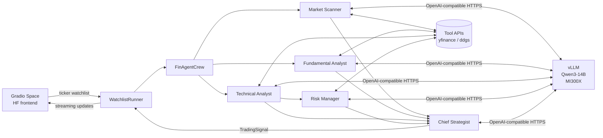

# FinAgent

**AI trading signal generator. Five AI agents work together on one AMD Instinct MI300X GPU to tell you whether to BUY, SELL, or HOLD a stock — with a confidence score, entry price, stop loss, target price, and reasoning from each agent.**

Built for the [AMD Developer Hackathon](https://lablab.ai/ai-hackathons/amd-developer) · Track: **AI Agents & Agentic Workflows** · May 2026.

|               |                                                                            |
| ------------- | -------------------------------------------------------------------------- |
| **Live demo** | <https://huggingface.co/spaces/lablab-ai-amd-developer-hackathon/finagent> |
| **Track**     | AI Agents & Agentic Workflows                                              |
| **Model**     | Qwen/Qwen3-14B via vLLM 0.17 on ROCm 7.2                                   |
| **Hardware**  | AMD Instinct MI300X (AMD Developer Cloud)                                  |
| **License**   | MIT                                                                        |

---

## The problem

Most retail traders watch 10 or 20 stocks at once and have to pick which ones to pay attention to each day. Most AI tools try to help by asking one general-purpose model one big question. The answer looks confident but is usually shallow, and every stock gets basically the same reply.

A real investment team works differently. One person reads the news. Another looks at the financials. Another looks at the charts. Another figures out how much money to risk. Then the head of strategy puts it all together and makes the call.

## The solution

FinAgent copies that team structure. Five AI agents run against one Qwen3-14B model hosted on an AMD MI300X GPU. Each agent has its own job and its own tools. They run in the right order (news + financials + charts first, then risk, then the final decision), and the final answer is formatted so the Gradio frontend can show it as a clean signal card.

Everything runs on our own GPU — **no OpenAI, no Claude, no API bills**. The $100 of free AMD Developer Cloud credit is the entire compute budget.

---

## Architecture



| Folder             | What it does                                                                |
| ------------------ | --------------------------------------------------------------------------- |
| `inference/`       | Scripts that install vLLM + ROCm and run Qwen3-14B on the MI300X            |
| `tools/`           | 10 helper functions the agents call (yfinance, DuckDuckGo news, pandas-ta)  |
| `crew/`            | The 5 agents, how they pass work to each other, and the final signal parser |
| `gradio-frontend/` | The dark financial-terminal UI — also deployable as a Hugging Face Space    |

## The five agents

| #   | Agent                   | What it does                                              | Tools it uses                                   |
| --- | ----------------------- | --------------------------------------------------------- | ----------------------------------------------- |
| 1   | **Market Scanner**      | Reads recent news and spots unusual price or volume moves | `search_news`, `get_price_change`, `get_volume` |
| 2   | **Fundamental Analyst** | Checks whether the company is fairly valued               | `get_financials`, `get_earnings`, `get_peers`   |
| 3   | **Technical Analyst**   | Reads the chart — trend, RSI, MACD, Bollinger Bands       | `get_price_history`, `calculate_indicators`     |
| 4   | **Risk Manager**        | Sets position size and stop-loss based on volatility      | `calculate_position_size`, `set_stop_loss`      |
| 5   | **Chief Strategist**    | Combines agents 1–4 and picks BUY, SELL, or HOLD          | — just reasoning                                |

Agents 1, 2, 3 run at the same time. Risk Manager waits for the Technical Analyst's entry price. Chief Strategist waits for all four.

## Example output

For a watchlist `AAPL, NVDA, BTC-USD`, each stock gets a card like this:

```
AAPL — BUY (Confidence: 75%)
Entry:     $293.32
Stop Loss: $284.52
Target:    $307.99

Reasoning:
- Market:      Price is trending up and above the 20-day average,
               but RSI is overbought so short-term pullback is possible
- Fundamental: Strong recent earnings, healthy profit margins (27%),
               but debt is high and P/E is above peers
- Technical:   Price above upper Bollinger Band ($291.39),
               RSI 73 (overbought), MACD neutral
- Risk:        1:2 risk/reward with a 5% stop-loss and 5% target.
               110 shares = 2% of a $100,000 portfolio
```

The entry price is taken from the live yfinance quote — not made up by the model. Stop-loss and target come from the Risk Manager's calculation, and there's a safety net that replaces any price that drifts too far from the live quote.

---

## What makes this project interesting

### 1. The model doesn't get to make up prices

Small LLMs confidently invent prices from their training data. A 14B model will happily tell you NVDA's entry is $10 on a day it's trading at $215. We don't let it. Every signal the user sees has its entry price set to the live yfinance quote, and the stop / target are rescaled around that live price. If the model's output is too garbled to parse at all, we build a clean signal from the live price directly. The card always reflects real market data.

### 2. One model, five agents

Most CrewAI examples give each agent its own LLM connection. We give all five agents the same one. vLLM keeps a cache of recent prompt prefixes, so when five agents start with similar context, vLLM skips redundant work — you get faster responses on the MI300X.

### 3. One bad ticker doesn't break the whole run

If one stock blows up (bad symbol, network glitch, weird LLM output), the runner catches the error and keeps going. You still get clean cards for the other tickers, and one error card for the broken one.

### 4. You can watch the agents work in real time

Every step each agent takes fires an event to the frontend. You see "Market Scanner running", "Technical Analyst finished", etc. as it happens, instead of staring at a spinner.

### 5. 309 tests, run on every commit

The codebase has 309 automated tests, including randomised tests (via Hypothesis) that throw thousands of weird inputs at the parser and agents to make sure nothing breaks. Examples of what's tested:

- Every agent gets the same vLLM URL (it would be a disaster if one silently went to OpenAI)
- A formatted signal round-trips through the parser without losing or changing numbers
- The watchlist parser handles weird spacing, casing, and empty entries
- If a ticker fails, the runner's total count still adds up: successes + failures = tickers

---

## Folder layout

```
FinAgent/
├── crew/                     # The 5 agents and how they hand off work
├── tools/                    # 10 tool functions (yfinance, ddgs, pandas-ta)
├── inference/                # Scripts to run vLLM + Qwen on an AMD MI300X
├── gradio-frontend/
│   ├── app.py                # The Gradio UI
│   ├── validation.py         # Ticker / portfolio input checks
│   ├── rendering.py          # HTML for cards, activity feed, styles
│   └── space/                # Ready-to-push HF Space copy of everything
├── tests/                    # Tests for the agent orchestration
├── _crewai_mocks.py          # Test-only CrewAI substitutes
├── conftest.py               # Root pytest config
├── requirements.txt          # Runtime dependencies
└── requirements-dev.txt      # Extra dependencies for running tests
```

---

## Quick start (run it locally)

### You'll need

- Python 3.11 or newer (tested on 3.13)
- Git and pip
- A vLLM endpoint. You can run one yourself with `inference/setup.sh` on an AMD GPU, or point at any OpenAI-compatible endpoint for testing.

### Install

```bash
git clone https://github.com/emmanuelakbi/FinAgent.git
cd FinAgent
python3 -m venv .venv
source .venv/bin/activate
pip install -r requirements.txt -r requirements-dev.txt
```

### Run the tests

```bash
pytest tests/ tools/tests/ inference/tests/ gradio-frontend/tests/ -m "not integration"
# → 309 passed
```

### Run the app locally

```bash
export VLLM_ENDPOINT_URL=http://localhost:8000/v1   # or wherever your vLLM is
python gradio-frontend/app.py
# → http://127.0.0.1:7860
```

### Deploy the UI to a Hugging Face Space

There's a ready-to-push Space copy at `gradio-frontend/space/` — it has `app.py`, `requirements.txt`, the `crew/` and `tools/` folders, and the Space-style README. Create a new Space on Hugging Face (pick Gradio SDK, CPU basic), clone it, copy everything from `gradio-frontend/space/` into it, and push. Set a `VLLM_ENDPOINT_URL` secret on the Space pointing at your vLLM server and it'll be live.

---

## Run it on your own GPU in under 10 minutes

If the live Space at `huggingface.co/spaces/lablab-ai-amd-developer-hackathon/finagent` is down, here's how to run the whole thing yourself. The project talks to any OpenAI-compatible server, so it works on AMD GPUs, Nvidia GPUs, or even a hosted provider.

### On an AMD MI300X (what we used)

```bash
# 1. Get the code
git clone https://github.com/emmanuelakbi/FinAgent.git
cd FinAgent

# 2. Start vLLM with Qwen3-14B and tool-calling on
cd inference
./setup.sh --host 0.0.0.0 --port 8000
# Wait about 30 seconds for "Application startup complete", then check it works:
./health_check.sh --host 0.0.0.0 --port 8000

# 3. In another terminal, start the Gradio app
cd ..
pip install -r requirements.txt
export VLLM_ENDPOINT_URL=http://localhost:8000/v1
python gradio-frontend/app.py
# Open http://127.0.0.1:7860 and type in a watchlist
```

### On any other GPU (A100, H100, RTX 4090 with enough VRAM)

Qwen3-14B needs about 28 GB of VRAM. Skip `inference/setup.sh` and run plain vLLM:

```bash
pip install "vllm>=0.17"
vllm serve Qwen/Qwen3-14B \
    --host 0.0.0.0 --port 8000 \
    --enable-auto-tool-choice --tool-call-parser hermes

# Then, back in the repo:
pip install -r requirements.txt
export VLLM_ENDPOINT_URL=http://localhost:8000/v1
python gradio-frontend/app.py
```

### No GPU? Use a hosted Qwen3-14B endpoint

Point `VLLM_ENDPOINT_URL` at any OpenAI-compatible server that runs Qwen3-14B (Together AI, Fireworks, OpenRouter all work):

```bash
export VLLM_ENDPOINT_URL=https://your-provider/v1
export OPENAI_API_KEY=your_key   # optional for vLLM, needed for hosted providers
python gradio-frontend/app.py
```

### Test the pipeline without the UI

```bash
# Runs the full 5-agent pipeline for AAPL and prints the result:
python -c "
from crew import LLMConfig, OrchestratorConfig, WatchlistRunner
from tools import (search_news, get_price_change, get_volume,
                   get_financials, get_earnings, get_peers,
                   get_price_history, calculate_indicators,
                   calculate_position_size, set_stop_loss)
runner = WatchlistRunner(
    config=OrchestratorConfig(llm=LLMConfig(base_url='http://localhost:8000/v1')),
    tools={
        'market_scanner': [search_news, get_price_change, get_volume],
        'fundamental_analyst': [get_financials, get_earnings, get_peers],
        'technical_analyst': [get_price_history, calculate_indicators],
        'risk_manager': [calculate_position_size, set_stop_loss],
    },
)
print(runner.run('AAPL'))
"
```

### Run the full test suite

```bash
pip install -r requirements-dev.txt
pytest tests/ tools/tests/ inference/tests/ gradio-frontend/tests/ -m "not integration"
# -> 309 passed
```

---

## Tech stack

| Piece            | What we used                           | Why                                                                                 |
| ---------------- | -------------------------------------- | ----------------------------------------------------------------------------------- |
| Agent framework  | **CrewAI 1.14**                        | Built-in role + task + dependency model that handles "wait for this other agent"    |
| Inference server | **vLLM 0.17**                          | Fast, caches repeated prompts, works natively on AMD MI300X                         |
| Model            | **Qwen/Qwen3-14B**                     | Good at following instructions and calling tools, runs in ~28 GB VRAM, open-weights |
| GPU runtime      | **ROCm 7.2**                           | AMD's GPU stack for MI300X, PyTorch 2.7 has matching ROCm builds                    |
| LLM client       | **crewai.LLM (litellm hosted_vllm)**   | Works with any OpenAI-compatible URL, and supports tool-calling                     |
| Frontend         | **Gradio 5**                           | Hugging Face Spaces native; streams updates to the UI while agents work             |
| Tools            | **yfinance · ddgs · pandas-ta-remake** | All free and keyless — no API tokens needed                                         |
| Testing          | **pytest 8 + hypothesis 6**            | 309 passing; every key guarantee in the code has a test that tries to break it      |

---

## Cost note

The $100 of AMD Developer Cloud credit is the entire compute budget.
The MI300X costs about $2–5 per hour, so that's 20–50 hours of runtime on a single credit.
The GPU only needs to be on while someone is actually using the Gradio app — turning it off between sessions saves the remaining credit.

---

## How it was built

I started with one rule: every price a user sees must come from real market data, not from the model's imagination. The rest of the design followed from that rule.

**The 5-agent structure** mirrors how a real investment team splits the work. Scanner, Fundamental Analyst, and Technical Analyst all look at the same stock at the same time, each from their own angle. Risk Manager can't do its job until Technical picks an entry price, so it waits. Chief Strategist waits for all four and makes the final call. CrewAI handles the "wait for this other agent" plumbing so I didn't have to build a scheduler.

**The grounding layer** was the hardest part. A 14B model running at temperature 0.7 will cheerfully tell you NVDA's entry is $10.00 when it's actually $215. Asking nicely in the prompt didn't work. So I wrote code that runs _after_ the model — it takes whatever prices the model emitted, keeps the model's risk/reward shape, but replaces the entry with the live yfinance quote and scales the stop + target to match. If the model's output is too broken to parse at all, the code builds a clean signal from the live price by itself. The pipeline went from "usually works" to "always gives a card with real numbers."

**The tests** were written before the features. The rule was: for every guarantee the code is supposed to make — "every agent uses the same vLLM URL", "the watchlist parser handles bad input", "one failed ticker doesn't break the rest" — write a test that tries to break it with randomised inputs. Hypothesis (the property-based testing library) generates thousands of weird inputs automatically. 309 tests pass on every commit.

**The Risk Tolerance / Trading Style dropdowns actually matter.** Conservative + Day Trading gives you a tight 1.5% stop and 2% target. Aggressive + Position Trading gives you a wide 5% stop and 10% target. Same stock, same moment, different numbers — because the dropdowns are wired all the way through to both the Strategist's prompt and the grounding layer.

**Inference is self-hosted** — no OpenAI, no Claude, no API bills. vLLM on ROCm serves Qwen3-14B from the MI300X with an OpenAI-compatible API. All five agents use the same model instance, so vLLM's prompt cache kicks in and things run faster on repeated prefixes.

---

## Disclaimer

⚠️ **The signals produced here are for information only and are not financial advice.** Do your own research before making any trade.

---

## Acknowledgments

- [AMD Developer Cloud](https://www.amd.com/en/developer/resources/cloud-access/amd-developer-cloud.html) — MI300X compute credit
- [Qwen team at Alibaba Cloud](https://qwen.ai) — open-weights models
- [CrewAI](https://www.crewai.com/) — agent orchestration framework
- [vLLM project](https://github.com/vllm-project/vllm) — high-throughput LLM serving with ROCm support
- [lablab.ai](https://lablab.ai) — hackathon platform
